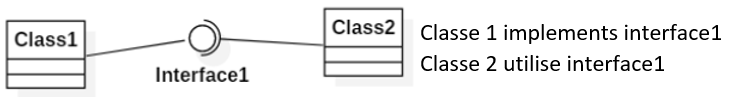
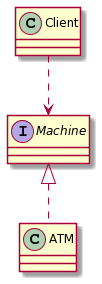

# Interfaces

[Go back](../index.md)

As you memorized, you can't generalize more than one class. If you want to make sure a class has some operations, then you should use interfaces, because **a class can implement many interfaces** <small>(a class $C$ implementing an interface $I$ means that $C$ is inheriting $I$)</small>.

An interface can only have

* **public static final** attributes (=constants)
* **public methods** (instance methods)
* **public static methods** (class methods)
* constructors not allowed
* <small>(in fact, an interface can have default methods and private methods too)</small>

<hr class="sl">

## Uses

* to create an abstract type

```java
Machine machine;
```

Let's say Machine is an interface, it can't be instanced, but we could store inside this variable **any object implementing Machine**. We can also call on this object any methods defined in Machine.

* methods do not have code

Most of the time, methods are empty, and it's up to the class implementing the interface to implements the method.

You can add a ``<<default>>`` before the method name if this method can be coded inside the interface, but since interfaces do not have attributes, it shouldn't be something you will do often.

<hr class="sr">

## Lollipop interface

If your interface is empty, you can use the lollipop interface



* class1 is implementing interface1
* class2 is using interface1

<hr class="sl">

## Common design



* ATM is implementing Machine
* Client is using (a) Machine