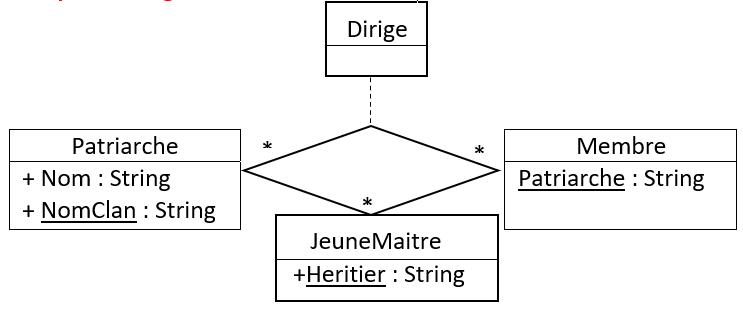

# multi-classes associations

[Go back](../index.md)

This a complex relationship also called the ``association n-aires``
in French, with ``n`` the number of classes.

Here we got 3 classes and an association class

You read that as

* a ``Patriarche`` ``dirige`` * ``Membre`` and * ``JeunesMaitre``.
* a ``Membre`` ``dirige`` * ``Patriarche`` and * ``JeunesMaitre``.
* a ``JeunesMaitre`` ``dirige`` * ``Membre`` and * ``Patriarche``.