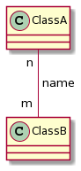

# Multiplicity

[Go back](..)

Note that here

* ``m`` is a value representing the number of instances of the class **A**
  interacting with object of the class **B**
* ``n`` is a value representing the number of instances of the class **B**
  interacting with object of the class **A**

**Notice that the value is at the opposite side**. 
The values that we can use are

* `n`: only ``n``, a number like 0,1,4,...
* ``*``: 0 or more
* ``0..1``: 0 or 1
* ``0..*``: same as `*`
* ``1..*``: 1 or more
* ``n..*``: ``n`` or more
* ``n..m``: at least ``n`` and up to ``m``
* `n..n`: same as ``n``

So we could replace our `n` by ``0..1`` (0 or 1)
and our ``m`` by `*` (0 or more).

