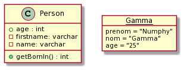

# Class diagram

[Go back](../index.md)

A **Class** is an abstract representation of a concept,
like a person here. We have what we call

* field / attributes (age, name, ...)
* operations (age)

When we are giving values to our attributes,
we are creating an **instance** of the class called
an **object**.

Notes

* Classes start with an uppercase, using CamelCase
  syntax (upperCamelCase)
* Object name is <u>underlined</u>, you can think of this
name as the **variable name** storing this object
  

## Attributes

Attributes got 

* a visibility
    * **public** (+, read/write for all, default)
    * **private** (-, read/write only inside the class)
    * **package** (~, read/write for all inside the folder)
    * **protected** (#, same as package, but read/write
      for all classes inheriting this class)
* a name
* a [type](types.md)
* a value (not required)

**Notes**

* if attributes have a ``/`` before the visibility, 
  that means it's a **derived attribute** so the value
  is calculated using other attributes.
* an attribute **underlined** is static meaning the
  value and the attribute is shared by all instances
  and belongs to the class
* a constant is usually static

## Operations

An operation is the UML name for a method/function. You
will have

* a visibility
* a function name (usually in lowerCamelCase)
* some arguments
  * separated by a comma
  * name:type
* a return type (none isn't the same as void, like
  for a Java constructor)

**Ex**: ``+ getName() : String`` is
a public operation getName taking no arguments
and returning a String.

**Notes**

* If your method is creating / destroying objects,
  then you should add `<<constructor>>`/``<<create>>``
  and ``<<destroy>>`` after the visibility
* an operation **underlined** is static