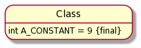
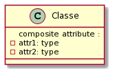
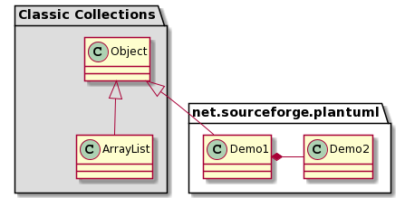

# Class diagram

[Go back](../index.md)

A **Class** is an abstract representation of a concept,
like a person here. We have what we call

* field / attributes (age, name, ...)
* operations (age)

When we are giving values to our attributes,
we are creating an **instance** of the class called
an **object**.

Notes

* Classes start with an uppercase, using CamelCase
  syntax (upperCamelCase)
* Object name is <u>underlined</u>, you can think of this
name as the **variable name** storing this object
  

## Attributes

Attributes got 

* a visibility
    * **public** (+, read/write for all, default)
    * **private** (-, read/write only inside the class)
    * **package** (~, read/write for all inside the folder)
    * **protected** (#, same as package, but read/write
      for all classes inheriting this class)
* a name
* a [type](types.md)
* a value (not required)

**Notes**

* if attributes have a ``/`` before the visibility, 
  that means it's a **derived attribute** so the value
  is calculated using other attributes.
* an attribute **underlined** is static meaning the
  value and the attribute is shared by all instances
  and belongs to the class
* a constant is usually static, I'm doing that
  by adding a ``{final}`` after the type in StarUML

* **composite attributes** are attributes made of more
  attributes. I have only seen that used in JavaScript since
  you can create object that do not have a class
  

## Operations

An operation is the UML name for a method/function. You
will have

* a visibility
* a function name (usually in lowerCamelCase)
* some arguments
  * separated by a comma
  * name:type
* a return type (none isn't the same as void, like
  for a Java constructor)

**Ex**: ``+ getName() : String`` is
a public operation getName taking no arguments
and returning a String.

**Notes**

* If your method is creating / destroying objects,
  then you should add `<<constructor>>`/``<<create>>``
  and ``<<destroy>>`` after the visibility
* an operation **underlined** is static

## Associations and multiplicity

Now that you can write a class and add some
attributes / operations, then we will look at relationships 
defined by what we call associations.
An association is a representation of a link between
two classes. We usually write a multiplicity n..m characterizing how many instances of the classes
are linked with how many of the other classes and a name
to remember what kind of links it is.

* [Multiplicity](content/multiplicity.md)
* [association classes](content/association-classes.md)
* an association from A to A is called
  self association or ``association réflexive``
  in French
* you can add a direction
* name isn't required
* you can have multiples associations between 2 classes

And sometimes you may declare an attribute having the type
of another class inside your diagram. Some programmers
are adding the attribute on the association rather than
inside the class but not everyone do this.

## Advanced associations

You are gonna use the generalization a lot to factorize
your code logic, but aggregation/compositions are not really
helpful.

* [generalization](content/generalization.md)
* [generalization - interfaces](content/interfaces.md)
* [generalization - abstract classes](content/abstract-classes.md)
* [aggregations](content/aggregations.md)
* [compositions](content/compositions.md)
* [multi-classes associations](content/multi-classes.md)

## Packages

You can group classes by packages (=folders) to make something
cleaner. Usually a package name is a path name
starting from the project folder package name
using ``.`` as folder separator. You will usually
see names like ``net.sourceforge.plantuml`` for
``net/sourceforge/plantuml/`` folder.

