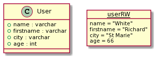
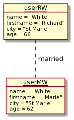

# Object diagram

An object diagram is an instance of a class diagram. Instead of having rectangles representing classes, you will have objects and give values to their class attributes.

The class name is replaced by the name of the variable used to store this object, and the name is underlined.

An association becomes one or more **links** according to the multiplicity.