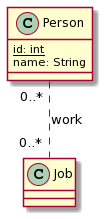
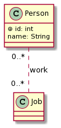

# Database diagram

[Go back](../index.md)

A database diagram is a simplified **class diagram**
with some minor changes. If you don't
understand this diagram (aside
from the underlined attribute)

Then read/learn about

* what's a class/attribute
* what's an association and multiplicity
* and read about generalization (~=inheritance)

## Differences with class diagrams

There are some things you should note before
we continue

* everything is public so we don't care about visibility
* you will rarely use operations, but if that's allowed
* you may use abstract classes / interfaces / constraints etc.
* an **underlined** attribute
  **do not means static**
  but that means that the attribute is
  a **key** (explained later)
* a ``#`` before an attribute **do not means protected**
  (visibility) but that means that the attribute is
  a **key** (explained later)

## Keys

In most cases and in all cases if you are making something
great, a class have what we call a **key**. It's an attribute
taking a unique value that will be used to reference
an object.

* ``Identifiant/discriminant``

That's the name in UML for a Key, because Key isn't a
conception concept but an implementation one. You will
write ``#`` and/or underline the attribute that is
the identifier.

You may have more than one attribute, and if that's the
case then the unique constraint is not applied to
each attribute of the key but all of them.

* ``Identifiant candidat``

A candidate to be the key, this attribute will also
have unique values but won't be used as the key or
as a part of it. Such attribute is preceded by a star `*`.

* ``Identifiant artificiel``

The most used kind of key. The key is generated
automatically when you add a new element. It's
represented by a beautiful star inside a circle ``⊛``.

## Constraints and OCL

You can also do that in "class diagrams" but it's more
used in database diagrams through it's almost never used.

We call integrity constraints the constraints applied
on an attribute like

* the type
* the multiplicity (if it's an array otherwise it's 1)
* properties like an interval of values allowed=Domain,
  a format, ...
* properties like unique etc.

You can specify those constraints using a note OR you
can use the [Object Constraint Language (OCL)](https://en.wikipedia.org/wiki/Object_Constraint_Language).

It's quite simple, right after your attribute
declaration, write ``{...}`` with ``...`` a condition using
OCL language like ``>=60``. If the condition
is applied on multiple attributes then you will
add the condition using ``{}`` on the class.

You can also add conditions on associations.