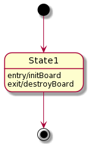
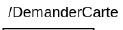
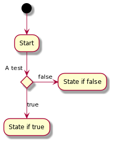
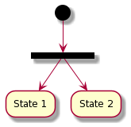

# Flow chart diagram

[Go back](../index.md)

Also called

* automate
*``diagramme d’activités`` / ``diagramme d’état-transitions``, 
* state diagram

It's representing all the states of the program and
the condition allowing the program to move from one
state to another.

## States

We got 3 kind of states

* initial state(s)
* intermediary state(s)
* and final state(s)

Here an example with all of them

When the program is starting, we are moving from one of the
initial states to another state. Then we are moving
from one state to another until one of the final states.

Inside "State", you could add attributes like

* ``entry/action`` where action is executed when entering
  this state
* ``exit/action`` where action is executed when exiting
  this state

## Transitions

The transitions are the arrows linking a state to another. You
may add on the arrow

* a trigger name (like what triggered us moving from one state to another)

* a condition (same as a trigger but a condition)

* an action (executed when moving)

## Conditional branching

This is how you can do a conditional branching.

Note that instead of using
"A test" and true/false, you could use the same symbol but
writing a condition instead of true/false. You could have
more than 2 state branched by using that, and the automate
will always take the most fitting condition like

* x = 5
* cond1: x < 5
* cond2: x > 0
* cond3: x == 5
* then the branch we will take is the one 
  having the condition cond3

Since not anyone may follows this rule, you may add
a note saying how your automate is choosing.

## Synchro bar

A synchro bar may be used if you want to both run
State1 and State2 at the same time.

