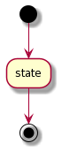

# Flow chart diagram

[Go back](../index.md)

Also called
automate or ``diagramme d’activités`` or
``diagramme d’état-transitions``, the flow chart diagram
is representing all the states of the program and
the condition allowing the program to move from one
state to another.

## States

We got 3 kind of states

* initial state(s)
* intermediary state(s)
* and final state(s)

Here an example with all of them

When the program is starting, we are moving from one of the
initial states to another state. Then we are moving
from one state to another until one of the final states.

