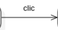
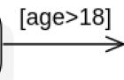

# Flow chart diagram

[Go back](../index.md)

Also called
automate or ``diagramme d’activités`` or
``diagramme d’état-transitions``, the flow chart diagram
is representing all the states of the program and
the condition allowing the program to move from one
state to another.

## States

We got 3 kind of states

* initial state(s)
* intermediary state(s)
* and final state(s)

Here an example with all of them

When the program is starting, we are moving from one of the
initial states to another state. Then we are moving
from one state to another until one of the final states.

Inside "State", you could add attributes like

* ``entry/action`` where action is executed when entering
  this state
* ``exit/action`` where action is executed when exiting
  this state

## Transitions

The transitions are the arrows linking a state to another. You
may add on the arrow

* a trigger name (like what triggered us moving from one state to another)

* a condition (same as a trigger but a condition)

* an action (executed when moving)

