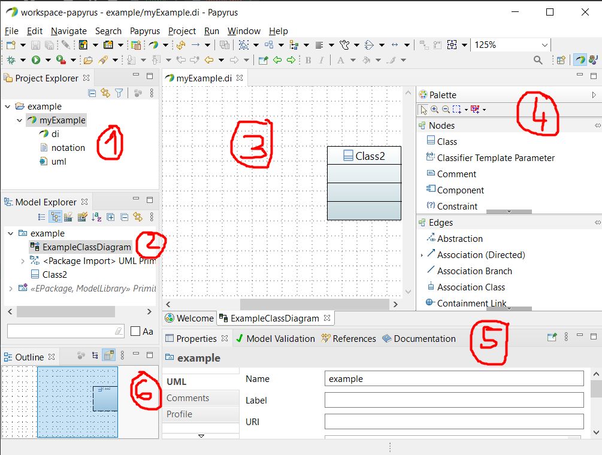
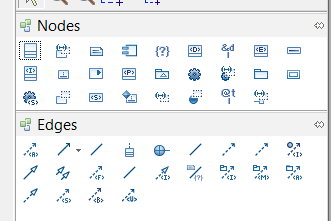
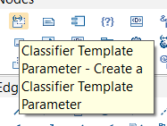
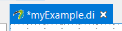
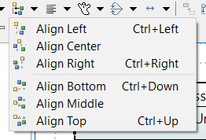
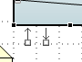
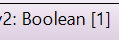

# Papyrus

[Go back](../index.md)

**Papyrus** is an open-source tool, made by the eclipse foundation,
allowing you to **create** UML diagram and **simulate** them
with some data that you are providing.
You can [download it here](https://www.eclipse.org/papyrus/download.html). Note that the current version is **5.0.0**, but it is [models generated with the previous version should work](https://projects.eclipse.org/projects/modeling.mdt.papyrus/releases/5.0.0/plan).

Once the software is started, create a **new papyrus model**. A model is made of 3 files (.di/.notation/.uml), don't share only one of them, it won't work. Also, just in case, **save your model often 😖**.

## Perspectives

First, there is a lot of perspectives <small>(way to see your project? such as Java or Papyrus (UML))</small>. Ensure that you are using the Papyrus perspective when you are creating models.

 and select 

If you used a perspective at least once, a shortcut will be available right next to the open perspective menu. You can also use "Window > Perspective".

## Interface

1. **Project explorer**: Double click on a model to open it
   * export your diagrams (right-click on model -> export)
   * open your project in the file explorer (right-click on the folder "example" and "show in")
2. **Model explorer**: Once you opened a model, you can add diagrams inside it using the Model explorer: right-click on "example" > "New diagram"
3. **Model editor**: edit your diagram here: move things from the palette to here
4. **Palette**: Everything that you can put in this kind of diagram
5. **Property view**: Edit the properties of something
   * ex: give another name to a class
   * ex: give a type to an attribute
   * ex: write some documentation
   * etc.
6. **Outline view**: You can move faster using the Outline tab
   * you can see your diagram from after
   * you can change the outline view and see your diagram as a tree

## My notes

* **Don't scroll** (when editing something)

You can scroll to change the values of a field (such as checked -> uncheck, or the type of your attribute, etc.) when you are in the **Property view**. Too bad 😂, you can't control it and might change something/cancel everything you did.

* **Use icons**

If you are like me, and you find it tiring to scroll in the Palette from class to property and back to class... You can change the layout of the Palette.

 and if you forgot, you can switch back or hover the icon 

* **Window > Preferences**

If you were looking for the settings (dark mode? but it sucks), or you might change the CSS theme used in the Model editor in "Papyrus > CSS Theme".

* **State**

This is really easy to notice, but you got a little start (as usual) to indicate if you saved or not .

* **View and model**

Beware! The Model explorer is the only thing you can trust. If the view changed, but the model didn't, then this is a "bug". If this happened to you, check that you are doing what you wanted as Papyrus is expecting you to do it (ex: renaming, etc.). You can hide things from the view too, but they will still be in the model.

* **Click-click** 🚬

If you want to create a bunch of things. Instead of dragging and dropping them inside the Model editor. Simply double-click on it! Each time you do so, a new element is created.

* **Align**

Either by using this icon  or <kbd>CTRL+{some arrow}</kbd>, **after selecting elements**, you can align every class based on the position of the last selected classes. This is a bit hard to use from my point of view. You can use "distribute" too.

## Knowledge-related stuff

* **Model** 👧👦

The model is something shared between every diagram. You can move something from the model to another diagram. If you change the model, it will be changed everywhere. 

## Class diagrams

* **Creating undirected associations** 〰

When selecting an association, the directed one is shown by default, but after clicking on the undirected one, it will switch

* **Special associations**

If you want to make a class that is implementing an interface (=**realizing** an interface), then the head of the arrow is on the interface.

Same for a class extending another class (=**generalization**), the head of the arrow is on the class we are extending.

* **Easily create associations** 🚀

Near the corners of a class, if you wait a bit while your mouse is on a class, this shortcut to create associations will appear

* **Types**

Ex: For an attribute, you got a field "Type" inside the UML tab, when you clicked on it. Click on "... > Tree > EPackage Primitive Types" and select your type.

> **Note**: "Boolean [1]" after the type mean that the **cardinality** is **1** (=this is a value, more than 1 means this is an array/a list/a queue/...). 
> **Note**: You could drag and drop a class inside the field, instead of picking a primitive type. 
> **Note**: if you need to create a new type, use either `DataType` (cannot be instanced) or `Primitive type` or a class if none are what you want.

* **Right-click**

If you right-click on a class/anything, you got a menu. Check **Format** if you want to reformat what you selected, and check **Filter** to show/hide operations/methods/...

* **Colors**

Add a color to your classes! We are usually using a color for the classes of the model, another for the classes of the view, another for the controllers, maybe one for the listeners too.

## Sources

* <https://www.eclipse.org/papyrus/resources/TutorialOnPapyrusUSE_d20101001.pdf>