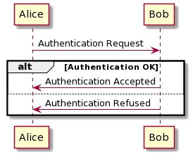

# alt (=alternatives) and opt (= optional)

[Go back](..)

``alt`` is a ``if else`` and `opt` is a `if`.

* the ``----`` line is used each time we add else,
  if we got only one then we don't have to add a condition
  (like a else if)
* the ``[...]`` is called the **guard** and it's the
  condition of the if