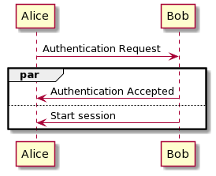

# par (parallel), seq (sequence), critical

[Go back](../index.md)

* <kbd>par</kbd> executes all blocs at the same time,
* <kbd>seq</kbd> execute one bloc at a time,
* and <kbd>critical</kbd> is used to wrap blocs of code that must be run
without errors otherwise the program can't continue
running.

Here is an example

