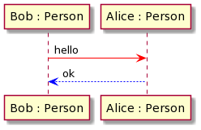
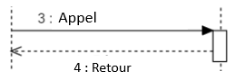

# Sequence diagram

[Go back](../index.md)

This diagram is a representation of an execution of the
program. You will have the timelines of your objects
and add the methods called and the arguments.

Usually, this diagram is made of

* a synopsis
* the diagram itself which can be either
  * SSD=System sequence diagram /``Diagramme Séquence système``
  * Sequence diagram /``Diagramme Séquence détaillé``

## Synopsis

This is a short story about what the diagram
will modelize. It's

* **short**: 3 to 5 sentences
* **instanced**: do not write "An User ..." but "Mickael ..."
* **easy to understand**:
    * only 3 to 5 use cases*
    * can be understood by a non-computer scientist

(*) If you don't know what are "use cases" then you MUST
check the UML diagram "use case diagram" since you will
select some use cases and show how they are called
inside the sequence diagram.

## System sequence diagram

A system sequence diagram is a sequence diagram
considered to be a black box. You don't know the
methods called or the arguments so you won't be able
to add them.

You will write a diagram having a lot of actors
with a lifeline, and at the end of it the
actor may die. An actor is an object of your program but
it may be a person (an user) if needed.

You read this diagram as

* an object of the class Person inside a variable **Bob** 
* an object of the class Person inside a variable **Alice**
* bob is calling "hello" on Alice
* Alice is returning "ok" for the call "hello"

Usually be draw a little rectangle to show the duration
of the method call, and we add a number to explicitly
clear any doubt about the order of the program execution

## Sequence diagram

The idea will be the same as above but instead of simply
writing "hello" or "ok", we are gonna use the program
methods, the argument and the correct return type.

We will also add a call when we are asking for an object
to be created / destroyed like "<<create>>" or
you may add arguments like "<<create("Bob")>>". A
constructor is returning the object created. You
may add a cross at the end of the timeline of an object
to show that it got destroyed.

## Messages

* **asynchronous messages**

That's a message that do not returns something (void
is considered as something). In such case, the caller
won't wait for the return and continue the execution
so we will have code running in parallel of our
code.

* **self messages**

This is a messages where the arrow is starting and
ending in the same lifeline. Nothing special.

* **logic**

There is no "return" if there is no "call".

A can only call a function on B if the function
exists in B.

If an object A is calling a method on B then in the
class diagram (if you got one), they MUST be linked.

## Sequence Fragments

In French, we call those ``Cadres d’interactions``. They
are allowing us to use loops, if, ... in our diagram.

* [alt/opt](frag/alt.md)
* [loop](frag/loop.md)
* [sd/ref](frag/sd.md)
* [par/seq/critical](frag/par.md)
* [break](frag/break.md)