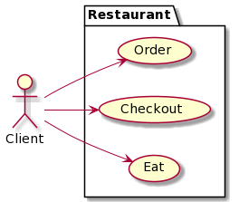
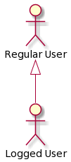
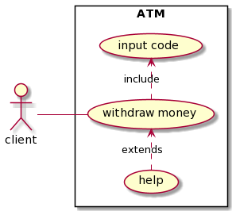

# Use case diagram

[Go back](../index.md)

The "Use case diagram" 

(or "Diagramme de cas d'utilisation / usage" = DCU)

is a diagram representing the interactions between

* users
* a system (basically your application)

**Note** that this diagram is not taking into
account the timeline, like you **can't** represent
the fact that an action will be done after another one.
If you think you can then you are doing it wrong. Check
the sequence diagram if you want to take into account
the timeline.

## Introduction

A DCU looks like this

with

* **the system**: the Restaurant
* **actors**: only one here, the Client, 
  those that interact with the system.
  Note that they are not persons but roles.
* **use cases**: "Order", "Eat", "Checkout". 
  What your actors can do in/with the system.
* **association**: link the actors with the use cases.

A system can be an actor in another system. Let's say
a shop is interacting with a factory. If the factory
is the system, then the shop is an actor. Using that
you can split a big use case diagram into a bunch
of smaller ones.

## Generalisation between actors

Let's says you got a regular user and a logged user
for the system "website". A logged user may be able to
do all of the regular user use cases and even more. You
can factorize this with inheritance.

This is called Generalisation and not inheritance (
or ``Héritage`` in French) since inheritance isn't
a UML concept but an implementation one.

## Use case associations

You can link use cases between themselves but DO REMEMBER
that you are not allowed to link use cases if it's
temporal like

* if the user is connected (=login)
* then he can see his/her profile (=seeProfile)

``login`` and ``seeProfile`` won't be linked together.
``login`` will be directly linked to an actor "RegularUser"
and ``seeProfile`` will also be directly linked to another
actor called "LoggedUser".

Aside from that, a use case can be linked with another
one by

* **a generalization**: if a use case generalize another
  then that means that we could use the use case
  OR any other generalizing this use case.
* **inclusion**: if an use case is **always**
  calling another one (like a method **always** calling another one)
* **extension**: a use case may call another one

A custom interacting with an ATM

* **may** ask for help (extension)
* **must** input his/her code