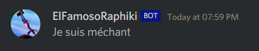

# Webhook

[Go back](..)

A webhook is something like [this](https://discohook.org/?data=eyJtZXNzYWdlcyI6W3siZGF0YSI6eyJjb250ZW50IjoiSmUgc3VpcyBtw6ljaGFudCIsImVtYmVkcyI6bnVsbCwidXNlcm5hbWUiOiJFbEZhbW9zb1JhcGhpa2kiLCJhdmF0YXJfdXJsIjoiaHR0cHM6Ly9jZG4uZGlzY29yZGFwcC5jb20vYXZhdGFycy8yODEzMzUyNDA2MTY1NzQ5NzcvODU0MDczYmY1NjNlYjk5YzEwZTFhNTY5ZGI5ZmE5Y2Iud2VicD9zaXplPTI1NiJ9fV19).
It's a bot taking someone else avatar/name and
posting a message in a channel



Using [discohook](https://discohook.org), you can
create your webhook online (or learn how a webhook
is made), then in Javascript

```js
// fetch channel webhooks
const webhooks = await channel.fetchWebhooks();
let hook = webhooks.first();
// check if there isn't an existing webhook
if (hook === undefined) {
    //creates
    await channel.createWebhook(Config.hook_name, {avatar: avatar})
        .then(webhook => { hook = webhook; })
        .catch(console.error);
}

// 
// params if the JSON you generated with
// discohook
// for instance
// let params = {username: name, avatarURL: avatar, content: message};
//
await hook.send(params);
```

Here the bot will create a webhook (if not
already one) for the channel then send a message using the webhook.
These created webhooks are in ``Integrations > [Your bot name]``
and not in the ``Webhook`` menu.

You may check out
<https://birdie0.github.io/discord-webhooks-guide/>
for a fully explained guide.