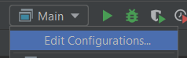
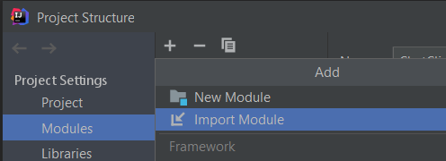

# IntelliJ IDEA

[Go back](../index.md)

There are two ways, one in two clicks and a longer one. The two click installation
won't install an external SceneBuilder and the problem of that is 

* you won't be able to look for components (using a search bar)
* there is no code menu

So **do the proper one**!

## Fast installation

* open project, cancel if asked to find JDK
* Simply open a ``.fxml`` file.
* at the bottom of the file view, you got a ``SceneBuilder``, click on it
* then click ``Install JavaFX`` red message
* then click ``Install SceneBuilder`` red message
* done

## Normal yet easy installation

Use the official tutorial if you are lost, the screenshots are pretty useful
[Tutorial](https://openjfx.io/openjfx-docs/#IDEA-IDE).

* open project, cancel if asked to find JDK
* `CTRL+MAJ+ALT+S` (Open Project Structure)
    * in `Modules`: remove the two lines in red
    * in ``Library``: click on `+` then ``From Maven``
    and 
      * write ``org.openjfx:javafx-fxml:16``
      * select ``download to`` and put it in a **lib** folder at the root of the
    project (should be the default path anyways)

JavaFX is now installed, now let's install ``SceneBuilder``.

* [Download here SceneBuilder](https://gluonhq.com/products/scene-builder/#download)
* Install it, keep the path of your new program with a copy-paste
* in IntelliJ, go to settings (`CTRL+ALT+S`)
* type ``JavaFX``, then in ``Language and Frameworks`` put the path to
your SceneBuilder executable.
  
You can now make the view but let's make a configuration to run our **Main**.

* go in Main.java, and try to start it : you got an error
* go to ``Edit Configurations`` 
* type ``ALT-V`` to show VM options input field
* and write ``--module-path lib --add-modules javafx.controls,javafx.fxml``

**ALSO while you are here**, set program 
argument ``-name a_name_here``.

## And now?

You need to right-click on a .fxml file, at the end of the
context menu, you got **Open in SceneBuilder** so simply
press it and make the view.

Then after you are done, simply use the green arrow
(a.k.a. run button) to start your program. You can copy
and paste a configuration (in the edit configuration
menu) and change the name.

If you need to run the server, I put
everything in the same folder so I used IntelliJ
import-module function and that was it.

