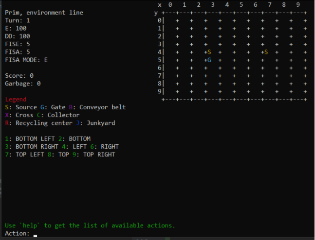

# IT Project

This is a review of the ENSIIE IT Project (2nd semester) taught by Dimitri WATEL.

You will have to follow a lot of directives to make a Game in C, in a group of 4.

* ``lot_a``: create the `.h` files
* ``lot_b``: make the game (v1)
* ``lot_c``: improve the game (graphical interface? ... You can use another language.)

You [can find our code here](https://github.com/lgs-games/prim/tree/master/version_c), we got 20/20.
  
<hr class="sr">

## Lot_a

In the ``lot_a``, you need to write the headers files:

* functions' declarations/prototypes
* type declarations (but not their actual content, like a class without attributes)
* document everything (using Doxygen if you want to be great)

```c
// you will declare Map later, for instance in a .c
typedef struct Map_S Map;

// you can use Map even if you don't know what's
// a map
Map *map_create(Difficulty dif);
```

The hardest thing is planning what you will code like, should

* your function returns a value or pointer? (remember that   a value **can't** be NULL)
* your function's argument should be const? (only a pointer can be "const")
* your function's argument be a pointer or not? (are you going to modify the address (pointer) or only the content?)

May this "tutorial" help

* read the subject once
  * make some notes about the rules
  * if you don't understand something, skip it
* read the subject again,
  * try drawing the screen as if you were planning to make a graphical version
  * try playing the game you draw, do not skip anything
  * by doing so, you may find a lot of things like what functions are needed and what are their parameters
* **COMMENT YOUR CODE** (you may use
  [doxygen](../../tools/doxygen/index.md))
* think about the names (try making sure everyone will use the same kind of names, so we don't have a map_create and a staff_new... or that we don't add newStaff and create_map...)
  * we used the `file_name_aFunctionName` kind of syntax like in ``map.h`` we would have `ErrorCode map_endTurn(Map *m);`
  * note that we are returning Codes instead of a boolean so that we can easily log/translate the errors

You should think by now about what you are planning to do in the lot_c, because it will impact how you will code your lot_a and your lot_b.

* will you translate your game?
* will you have a different graphical interface? (ex: a terminal one and a graphical one)
  * if you do, try to think if you should add some methods like ``interface_init`` or ``interface_close`` that may be used by graphical engines to set up themselves
* will you add some new functionalities later? if yes, then make your main so you won't have to change it.
* ...

<hr class="sl">

## Lot_b

* const.h: we define inside **all our constants** and in  **const.c** we set all global constants/variables like an array of xxx (staffs/machines/...).
* don't forget to test the interface (write using sentences what you did)
* And note some "missing" types. If you are using an array of 4 cases **a lot of times**, then maybe that's a type that you must create.
  
You may use NCurses to make your interface. It's quite easy to use and should improve your grade

* course [here](../../info/c#using-ncurses)
* if a teacher is complaining (that should not be the case, since Dimitri WATEL allowed it)
  * NCurses is available on the ENSIIE computers
  * he only has to ssh and compile/run your code
  * or he may use docker

You can do something like that quite easily



<hr class="sr">

## Lot_c

We used ``electron``  with JavaScript/TypeScript to make the graphical interface since, using this, the interface is in HTML/CSS and you can even use Bootstrap. Moving from ``C`` to `electron` was easy, but that won't always be the case (The more your code looks Oriented-Object, the easier it is).

If you are planning to stay in ``C``, you should check

* [SDL](https://wiki.libsdl.org/Installation)
  * Links / You may check on YouTube
  * <https://zestedesavoir.com/tutoriels/1014/utiliser-la-sdl-en-langage-c/>
  * <https://openclassrooms.com/fr/courses/19980-apprenez-a-programmer-en-c/17117-installation-de-la-sdl>
  * <https://www.geeksforgeeks.org/sdl-library-in-c-c-with-examples/>
  * <https://learncgames.com/tutorials/getting-started-with-sdl-and-c/>
* [GTK](https://www.gtk.org/)
  * same as SDL
  * <https://www.gtk.org/docs/getting-started/>
  * <https://docs.gtk.org/gtk3/>

<hr class="sl">

## Grades

First,

* a task is yours if you got assigned to it in the GANTT and you are the one who made it
* you didn't make 3 tasks or more: ``0/20``
* the code is not compiling/starting: ``0/20``

You will have a grade

* ``/12``, the mean of your three highest grades of each tasks
  * you got ``20`` for `A.x`
  * you got ``19`` for `B.x`
  * you got ``20`` for `B.y`
  * you got ``20`` for `C.y`
  * your grade is ``mean(20,20,20)=20/20`` so `12/12`
* ``/8``
  * ``lot_b`` on time `/1`
  * ``lot_b`` grade `/2`
  * ``lot_c`` on time `/2`
  * ``lot_c`` grade `/3`

But this notation was only because we were allowed a delay. And it was changed after some students complained because they wanted more without having done the "lot_c". The new grading was only applied if it gave you a better grade.

* ``/14``: same logic
* ``/6``: some changes
  * ``lot_b`` on time `/1`
  * ``lot_b`` grade `/3`
  * ``lot_c`` on time `/1`
  * ``lot_c`` grade `/1`