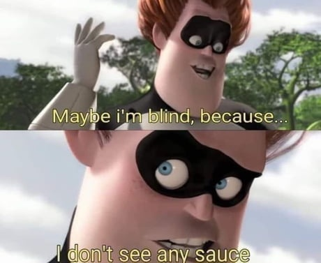

# Images

[Go back](..)

When dealing with images, you may want

* to remove the background (<https://www.remove.bg/>)
* to make/split/crop/... a gif/a normal image (<https://ezgif.com/>)
* resize a lot of images (<https://picresize.com/>)

## What's the sauce?

This website is supposed to help
you find the sauce when someone is
posting a chapter of a manga

* <https://saucenao.com/>

