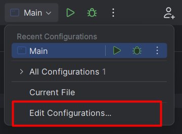

# IntelliJ IDEA

<div class="row row-cols-lg-2"><div>

[IntelliJ IDEA](https://www.jetbrains.com/idea/) is a **Java** <small>(Maven, Gradle, JavaFX, Junit)</small> and **Kotlin** IDE powered by JetBrains in a **free** and a **paid** version.

<p class="text-center">

</p>

👉 JetBrains IDEs share many features [explained here](../_general/index.md).
</div><div>

**Features**

* 🌱 can easily install Java JDKs, and switch between versions
* 🚀 recognize old code snippets and suggest upgrades
* 🔥 recognize common mistakes and suggest fixes
* ⏳ can generate common code snippets <small>(equals, getters...)</small>
* ...
</div></div>

<hr class="sep-both">

## Product-specific features

<div class="row row-cols-lg-2"><div>

#### Java JDKs

Press `CTRL+ALT+MAJ+S` or `⚙️ > Project Structure`. 

Navigate to the `Project` tab. From there, you can **download** a JDK, or **select** the JDK used for this project.

<br>

#### Add libraries

Press `CTRL+ALT+MAJ+S` or `⚙️ > Project Structure`.

Navigate to the `Libraries` tab. Click on `+`. By selecting "Java", you can import JARs. By selecting maven, you can download JARs from [maven repository](https://mvnrepository.com/) <small>(use the search bar within the IDE)</small>.

<br>

#### Junit

IDEA natively supports [JUnit5](https://www.jetbrains.com/help/idea/junit.html). Simply write a `@Test` in a class, then they will prompt you to import JUnit5.

For JUnit4, [you **may** have to do it manually](stuff/junit4.md).

🔥 Use `CTRL+SHIFT+T` to generate a test class.

<br>

#### Gradle

Each time you edit Gradle files, you'll have to reload gradle. A "reload" icon will pop up within the file.

On the right, there is a "Gradle" tab to run tasks with one click.

To run gradle from a terminal, set JAVA_HOME and use:

```ps
PS> $Env:JAVA_HOME="C:\Users\user\.jdks\some_sdk"
PS> .\gradlew.bat
```
</div><div>

#### Run Configurations

Similarly to other software, there are configurations where we can set which **javac/java options**, **program arguments**...



Once inside, not all fields are shown. For instance, to see `javac` options, you need to click on `Modify options > add VM options`.

#### Project Folders

Press `CTRL+ALT+MAJ+S` or `⚙️ > Project Structure`.

Navigate to the `Modules` tab, then "Sources". From there, you can set:

* Source folders <small>(folders with .java)</small>
* Build folders <small>(folders with generated files)</small>
* Tests folders <small>(folders with testing files)</small>
* Resources folders <small>(folders with images/... for use in a JAR)</small>
</div></div>