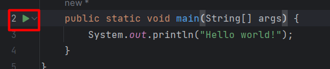
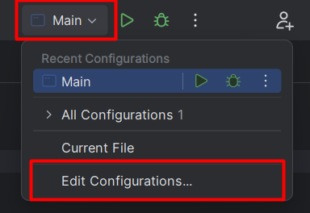
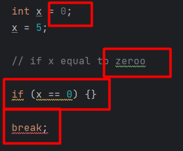
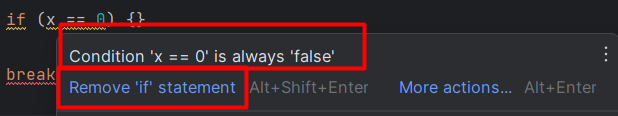

# JetBrains IDEs

All JetBrains IDEs share the same interface, and many common features such as:

* 🚀 Code improvement tips
* 🧼 Bugs, code smells, and typos detection
* ✨ GIT integration
* 🌍 Use of remote tools or environment
* 🗺️ UML generation for supported languages

And in each IDE, some languages, frameworks, and build tools have additional features and support. 

💵 Aside from [IntelliJ IDEA](../idea/index.md) and PyCharm, all IDEs are paid.

📱 [Android Studio](https://developer.android.com/studio), by Google, is based on IntelliJ IDEA community.

🎓 Their IDEs are [free for students](https://www.jetbrains.com/shop/eform/students).

🔥 You can manage all of their IDEs using the [toolbox](https://www.jetbrains.com/toolbox-app/).

## Running some code

There is a green play icon next to code that you can run:

This will create a **Run configuration**, which is a wrapper to all information related to the execution of your program. You could add compiler option, program arguments...

You can create, edit, or select a configuration here:

## Basic file edition

When coding, the IDE will highlight or underline problems.

* 🟥: this code won't compile
* 🟨: possible problem/warning
* 🟩: there may be a typo
* 🌫️: unused value or variable

In practice, there are more variations according to the specific problem.

#### Quick fixes

By hovering a problem, you'll have an explanation, along with suggested fixes. There is the `ALT+ENTER` shortcut for all quick fixes.

#### Autocompletion

When writing something, use `TAB` to select a choice among the suggested list. Use arrows to move up/down.

Use `CTRL+ENTER` to manually trigger autocompletion.

## Shortcuts

🔥 There is a search menu to look for files (`CTRL+SHIFT+N`), settings (`CTRL+SHIFT+A`). Open it with `Double Shift`.

* To enable zoom on scroll, search `mouse wheel`.
* To add a `*` to modified files, search `mark modified`.
* To set the proofreading language, search `natural language`.
* To enable soft wraps, search `soft wrap`.

#### Editing shortcuts

* <kbd>CTRL+C</kbd>, <kbd>CTRL+V</kbd>, <kbd>CTRL+X</kbd>, <kbd>CTRL+A</kbd>, <kbd>CTRL+F</kbd>: common ones
* <kbd>CTRL+D</kbd>: duplicate line or selection
* <kbd>SHIFT+ARROWS</kbd>: select a lot of lines
* <kbd>CTRL+Z</kbd>: undo
* <kbd>CTRL+SHIFT+Z</kbd>: redo 🙄
* <kbd>CTRL+SHIFT+F</kbd>: look for a word in a scope <small>(project, folder...)</small>

Use `CTRL+SHIFT+U` to toggle uppercase/lowercase.

#### Programming-specific

Comments

* <kbd>CTRL+/</kbd>: comment selected lines <small>(inline comment, such as //)</small>
* <kbd>CTRL+SHIFT+/</kbd>: comment selected lines <small>(block comment, such as /*)</small>

Generation

* <kbd>ALT+INSERT</kbd>: generate getters, setters, methods...
* <kbd>CTRL+ALT+T</kbd>: wrap selection inside a `if`/`for`/...
* <kbd>CTRL+ALT+MAJ+U</kbd> (paid): generate UML of selected files

Navigation

* <kbd>SHIFT+MouseLeft</kbd>: on a function call/..., navigate to the source
* <kbd>ALT+F7</kbd>: on a function/variable, list users
* <kbd>CTRL+SHIFT+E</kbd>: show the last opened/edited files

👉 Using `todo` or `fixme` in a comment, mark it as a TO-DO.

## Features

#### Interface

The interface has often changed over the years, especially as they are moving to a more compact interface.

👉 Use `CTRL+E` to see available menus.

🔥 There is a GIT menu, and a TODO menu which are helpful.

#### ContextMenu

The context menu is the left-click menu. These are worth a mention:

* Analyze 🔎: list all code smells, typos...
* Refactor 🎯: rename an element <small>(smart renaming)</small>
* Reformat 🧼: code cleanup
* Local History 🖼️: all changes to a file

#### GIT 🎒

There are two tabs: the "commit" tab (`ALT+0`), to commit and push, and the "git" tab (`ALT+9`), to see commits, change branch...

#### Refactor 🧼

You can refactor <small>(rename)</small> variables, functions, files. Once you do try, you'll see a list of all detected locations that use the element.

✨ Before confirming the refactoring, you can exclude or remove unwanted changes.

#### Snippets 🚀

Navigate to `Settings > Editor > Live template`. Create a new live template. Select the scope where it can be used.

You can create variables using `$variable_name$`.

## 👻 To-do 👻

Stuff that I found, but never read/used yet.

* [old](_old.md)
* CTRL+ALT+L (reformat)
* "+" > shared (code with me)
* <code>\`\`\`xxx!</code>
* scratch files

* Local History
* Project view
* CTRL-Q, CTRL-P

