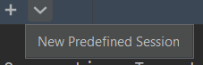

# Terminal

[Go back](../menus.md)

At the bottom of the screen, you can open a terminal.

You can change the kind of terminal (PowerShell, cmd, ...) in `Settings > Tools > Terminal`.

**edit 2021+**: you are now able to open a predefined kind of terminal using the arrow, right next to the "+".

