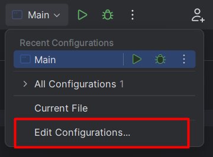

# IntelliJ IDEA

[IntelliJ IDEA](https://www.jetbrains.com/idea/) is a **Java** <small>(Maven, Gradle, JavaFX, Junit)</small> and **Kotlin** IDE powered by JetBrains in a **free** and a **paid** version.

👉 JetBrains IDEs share many features [explained here](../_general/index.md).

**Features**

* 🌱 can easily install Java JDKs, and switch between versions
* 🚀 recognize old code snippets and suggest upgrades
* 🔥 recognize common mistakes and suggest fixes
* ⏳ can generate common code snippets <small>(equals, getters...)</small>
* ...

## Product-specific features

#### Java JDKs

Press `CTRL+ALT+MAJ+S` or `⚙️ > Project Structure`. 

Navigate to the `Project` tab. From there, you can **download** a JDK, or **select** the JDK used for this project.

#### Add libraries

Press `CTRL+ALT+MAJ+S` or `⚙️ > Project Structure`.

Navigate to the `Libraries` tab. Click on `+`. By selecting "Java", you can import JARs. By selecting maven, you can download JARs from [maven repository](https://mvnrepository.com/) <small>(use the search bar within the IDE)</small>.

#### Junit

IDEA natively supports [JUnit5](https://www.jetbrains.com/help/idea/junit.html). Simply write a `@Test` in a class, then they will prompt you to import JUnit5.

For JUnit4, [you need to do it manually](stuff/junit4.md).

#### Configurations

Similarly to other software, there are configurations were we can set which **javac/java options**, **program arguments**...

Once inside, not all fields are shown. For instance, to see `javac` options, you need to click on `Modify options > add VM options`.

## 👻 To-do 👻

Stuff that I found, but never read/used yet.

* [old](_old.md)

