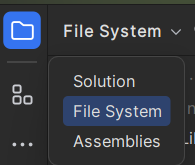

# Rider

<div class="row row-cols-md-2"><div>

[Rider](https://www.jetbrains.com/rider/) is a **.NET** IDE <small>(C#, Unity, Unreal Engine, .NET, C++...)</small> powered by JetBrains and exclusively available in a **paid** version.

<p class="text-center">

</p>

👉 JetBrains IDEs share many features [explained here](../_general/index.md).
</div><div>

**Features**

* 🌱 provide advanced support for game engines
* 🚀 recognize old code snippets and suggest upgrades
* 🔥 recognize simple mistakes and suggest fixes
* ⏳ can generate common code snippets <small>(equals, getters...)</small>
* 🫧 inform and suggest fixes for many code smells
* ...
</div></div>

<hr class="sep-both">

## Product-specific features

<div class="row row-cols-md-2"><div>

#### Solutions

Rider implements the concept called **solution** ([source](https://learn.microsoft.com/en-us/visualstudio/ide/solutions-and-projects-in-visual-studio?view=vs-2022)). A solution is a sort of master project composed of multiple related projects.

Assuming a ClassLibrary with `MyClass.cs`:

```cs
namespace ClassLibrary1.Sub;

public class MyClass
{
    public void Main()
    {
        Console.WriteLine("Hello, World!");
    }
}
```

Inside another project of the solution, you can use:

```
using ClassLibrary1.Sub; // ex: in Program.cs

var myClass = new MyClass();
myClass.Main();
```

By triggering JetBrains import features, you can automatically add the new project to the project file.

```
...
    <ItemGroup>
      <ProjectReference Include="..\ClassLibrary1\ClassLibrary1.csproj" />
    </ItemGroup>
...
```
</div><div>

#### Dotnet executable

The dotnet executable is installed at: `C:\Users\<username>\.dotnet\dotnet.exe` on Windows.

💡 When building and running a program, you can see that path.

#### Solution To File System

You can use this dropdown to see the `.csproj` files and other files hidden by the default solution view.


</div></div>