# Examples

### Example 1 - Rotate Left

[comment]: <> (["1" ["0"] ["3" ["2"] ["4" [Empty] ["5"]]]])

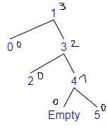

* Adding 5
* $bf(tree) = depth(left) - depth(right) = 0 - 2 = -2$
* The tree is **Right balanced**
* $bf(right) = depth(r\\_left) - depth(r\\_right) = 0 - 1 = -1$
* **Rotate Left**

[comment]: <> (["h=1" ["l=0"] ["rh=3" ["rl=2"] ["rr=4" [Empty] ["5"]]]])
[comment]: <> (["rh=3" ["h=1" ["l=0"] ["rl=2"]] ["rr=4" [Empty] ["5"]]])
[comment]: <> (["3" ["1" ["0"] ["2"]] ["4" [Empty] ["5"]]])

### Example 2 - Rotate Right

[comment]: <> (["4" ["2" ["1" ["0"] [Empty]] ["3"]] ["5"]])

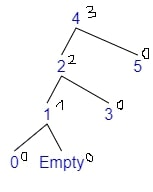

* Adding 0
* $bf(tree) = depth(left) - depth(right) = 2 - 0 = 2$
* The tree is **Left balanced**
* $bf(left) = depth(l\\_left) - depth(l\\_right) = 1 - 0 = 1$
* **Rotate Right**

[comment]: <> (["h=4" ["lh=2" ["ll=1" ["0"] [Empty]] ["lr=3"]] ["r=5"]])
[comment]: <> (["lh=2" ["ll=1" ["0"] ["Empty"]] ["h=4" ["lr=3"] ["r=5"]]])
[comment]: <> (["2" ["1" ["0"] ["Empty"]] ["4" ["3"] ["5"]]])

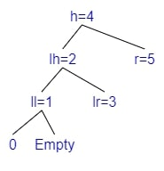
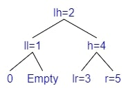
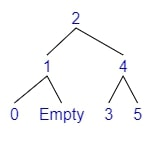

### Example 3 - Rotate Left Right

[comment]: <> (["4" ["1" ["0"] ["3" ["2"] ["Empty"]]] ["5"]])

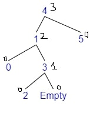

* Adding 2
* $bf(tree) = depth(left) - depth(right) = 2 - 0 = 2$
* The tree is **Left balanced**
* $bf(left) = depth(l\\_left) - depth(l\\_right) = 0 - 1 = -1$
* **Rotate Left Right**
  * We will Rotate Left the left
  * We will Rotate Right the tree

[comment]: <> (["h=4" ["lh=1" ["ll=0"] ["lrh=3" ["lrl=2"] ["lrr=Empty"]]] ["r=5"]])
[comment]: <> (["h=4" ["lrh=3" ["lh=1" ["ll=0"] ["lrl=2"]] ["lrr=Empty"]] ["r=5"]])
[comment]: <> (["lrh=3" ["lh=1" ["ll=0"] ["lrl=2"]] ["h=4" ["lrr=Empty"] ["r=5"]]])
[comment]: <> (["3" ["1" ["0"] ["2"]] ["4" ["Empty"] ["5"]]])

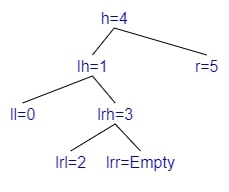
**Left Rotation**
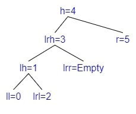
**Right Rotation**
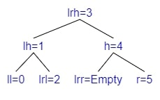

### Example 4 - Rotate Right Left

[comment]: <> (["1" ["0"] ["4" ["3" ["2"] ["Empty"]] ["5"] ]])

* Adding 2
* $bf(tree) = depth(left) - depth(right) = 0 - 2 = -2$
* The tree is **Right balanced**
* $bf(right) = depth(r\\_left) - depth(r\\_right) = 1 - 0 = 1$
* **Rotate Right Left**
  * We will Rotate Right the right
  * We will Rotate Left the tree

[comment]: <> (["h=1" ["l=0"] ["rh=4" ["rlh=3" ["rll=2"] ["rlr=Empty"]] ["rr=5"] ]])
[comment]: <> (["h=1" ["l=0"] ["rlh=3" ["rll=2"] ["rh=4" ["rlr=Empty"] ["rr=5"]]]])
[comment]: <> (["rlh=3" ["h=1" ["l=0"] ["rll=2"]] ["rh=4"["rlr=Empty"] ["rr=5"]]])
[comment]: <> (["3" ["1" ["0"] ["2"]] ["4"["Empty"] ["5"]]])

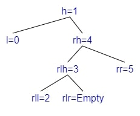
**Right Rotation**
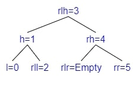
**Left Rotation**
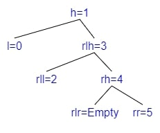
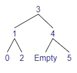