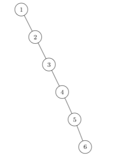
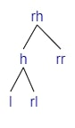
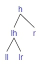
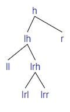
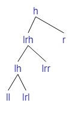
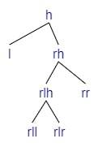
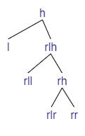
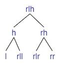

# AVL trees

<div class="row row-cols-md-2"><div>

An AVL (Adelson-Velsky and Landis) is a balanced [Binary Search Tree](../bst/index.md). We will ensure that there is no more than one level of depth between branches. The complexity is now $\log{(n)}$.

This is an example of a bad BST ($O(n)$) :

<div class="text-center">


</div>
</div><div>

Everything is the same as for a **Binary Search Trees**, but we will add a logic balance our tree during **add** and **remove**.

* ✅: faster than an ordered list for `add, remove`
* ✅: better than an unbalanced BST
* ✅: implementation is mostly the same as for a BST
* ❌: add and remove are **difficult** to understand/implement
* ❌: sightly slower than an ordered list for `mem`, `get_min`

<details class="details-n">
<summary>Time comparisons - 500 000 values between 0 and 10 000</summary>

Test results of an implementation in [OCaml](/programming-languages/high-level/func/ocaml/index.md).

```text!
>>>>>>>>>> TIME FOR A LIST <<<<<<<<<<
Average time of add:                     0.000046
Average time of remove:                  0.000047
Average time for mem:                    0.002340
Average time for get_min:                0.001870
Average time for cardinal:               0.353290 (long)
>>>>>>>>>> TIME FOR BST <<<<<<<<<<
Average time of add:                     0.000002
Average time of remove:                  0.000002
Average time for mem:                    0.006270
Average time for get_min:                0.003290
Average time for cardinal:               inf (too long)
>>>>>>>>>> TIME FOR AVL <<<<<<<<<<
Average time of add:                     0.000010
Average time of remove:                  0.000005
Average time for mem:                    0.003430
Average time for get_min:                0.002800
Average time for cardinal:               inf (too long)
```
</details>
</div></div>

<hr class="sep-both">

## Rotations

<div class="row row-cols-md-2"><div>

Each time we add an element <small>(parent node determined by the algorithm)</small>, we may have to correct imbalances using one of the 4 patterns below:

<div class="text-center">

[comment]: <> ([h [l] [rh [rl] [rr]] ])
[comment]: <> ([rh [h [l] [rl]] [rr] ])


**Left Rotation**


If we are adding a child to rr.
</div>

<div class="text-center mt-5">

[comment]: <> ([h [lh [ll] [lr]] [r]])
[comment]: <> ([lh [ll] [h [lr] [r]]])


**Right Rotation**


If we are adding a child to ll.
</div>
</div><div>

<div class="text-center">

[comment]: <> ([h [lh [ll] [lrh [lrl] [lrr]]] [r]])
[comment]: <> ([h [lrh [lh [ll] [lrl]] [lrr]] [r]])
[comment]: <> ([lrh [lh [ll] [lrl]] [h [lrr] [r]]])


Inserting in lr

Apply Left Rotation

Apply Right Rotation


If we are adding a child to **lr** <small>(=lrh if lr is empty, otherwise either lrl or lrr)</small>.
</div>

<div class="text-center mt-5">

[comment]: <> ([h [l] [rh [rlh [rll] [rlr]] [rr]]])
[comment]: <> ([h [l] [rlh [rll] [rh [rlr] [rr]]]])
[comment]: <> ([rlh [h [l] [rll]] [rh [rlr] [rr]]])


Inserting in rl

Apply Right Rotation

Apply Left Rotation


If we are adding a child to **rl** <small>(=rlh if lr is empty, otherwise either rll or rlr)</small>.
</div>
</div></div>

<hr class="sep-both">

## Algorithm

<div class="row row-cols-md-2"><div>

The **height** means the length of the longest path from that node to a leaf. The **Balance factor** of a node `bf(node)` is the difference of height between two branches <small>(left child node minus right child node)</small>.

<br>

#### Find where the tree is unbalanced

Calculate the balance factor of the root:

* `bf(root) = 2`: the tree is left-balanced
* `bf(root) = 2`: the tree is right-balanced
* Otherwise, do nothing
</div><div>

#### Correct a left-balanced tree

* `bf(right) = 1`: Apply a Rotate Right Left
* `bf(right) = 0`: ❌ (impossible)
* `bf(right) = -1`: Apply Rotate Left

<br>

#### Correct a right-balanced tree

* `bf(left) = 1`: Apply a Rotate Right
* `bf(left) = 0`: ❌ (impossible)
* `bf(left) = -1`: Apply Rotate Left Right
</div></div>

<hr class="sep-both">

## 👻 To-do 👻

Stuff that I found, but never read/used yet.

<div class="row row-cols-md-2"><div>

* [_old](_old.md)
</div><div>
</div></div>