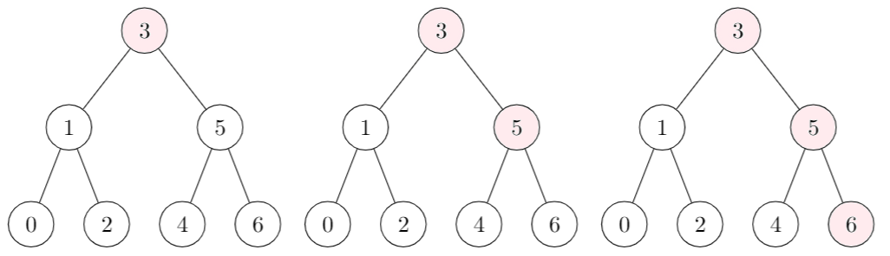

# Minimum or Maximum?

* The minimum is the bottom left value, the value
that was lesser than every other value

* The minimum is the bottom right value, the value
  that was greater than every other value

