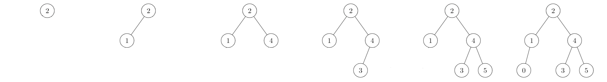
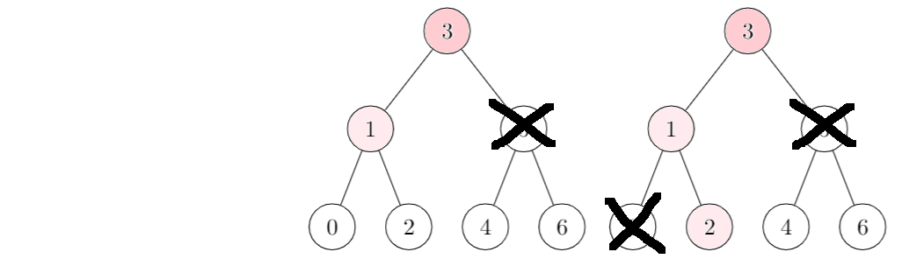

# Add an element in a BST

<div class="mt-3">


</div>

* We are adding **2** in the empty tree
* We are adding **1**: **left** (1 < 2)
* We are adding **4**: **right** (4 > 2)
* We are adding **3**: **right** (3 > 2) **left** (3 < 4)
* We are adding **5**: **right** (5 > 2) **right** (5 > 4)
* We are adding **0**: **left** (0 < 2) **left** (0 < 1)

**You mustn't add an element already in the tree**. Use an exception to exit faster your add, and returning the set (unchanged).
```ocaml
let add e set = try
	real_add_function set
with In -> set
```

<hr class="sr">

## Remove an element in a BST

<div class="mt-3">


</div>

* We are removing **3**: we are taking as the new head **4** (the min in the right)
* We are removing **4**: we are taking as the new head **5** (the min in the right)
* We are removing **6**: we are replacing **6** with **"Empty"** as **6** does not have children
* We are removing **5**: we don't have elements in our right, the new tree is made of the previous left

**Same as add. Use an exception to exit faster, if the element is not inside** (and return the unchanged set).
```ocaml
let remove e set = try
	real_remove_function e set
with Not_found -> set
```

<hr class="sl">

## Check if an element is in a BST

* Is **2** inside? 
  * As **2** is lesser than **3**, we are checking **1**. 
  * As **2** greater than **1**, we are checking **2**.
  * Result: IN. 



An element is **not in** if we can't check the next location we were supposed to check.

<hr class="sr">

## Minimum or Maximum?

* The minimum is the bottom left value, the value
that was lesser than every other value


* The minimum is the bottom right value, the value
  that was greater than every other value

