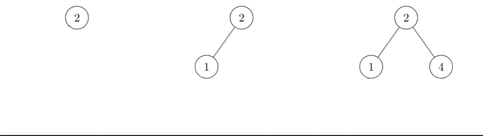
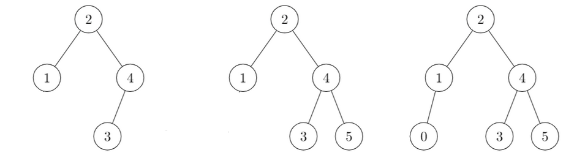
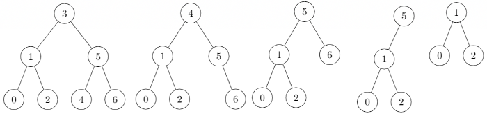

# Binary Search Tree (BST)

<div class="row row-cols-md-2"><div>

A Binary Search Tree (BST) is a tree with each node having up to two children nodes. The complexity is $O{(n)}$, but, on average, we got $O{(h)}$ with $h$ the height of the tree.

The height is the length of the longest path from the root to a leaf.
</div><div>

* ✅: easy to learn, and easy to implement
* ✅: faster than an ordered list for `add`, `remove`
* ❌: sightly slower than an ordered list for `mem`, `get_min`
* ❌: [AVL trees](../avl/index.md) are improved BST
* ❌: Unless storing the cardinal, calculating it takes too much time

<details class="details-n">
<summary>Time comparisons - 500 000 values between 0 and 10 000</summary>

Test results of an implementation in [OCaml](/programming-languages/high-level/func/ocaml/index.md).

```text!
>>>>>>>>>> TIME FOR LISTS <<<<<<<<<<
Average time of add:                     0.000046
Average time of remove:                  0.000047
Average time for mem:                    0.002340
Average time for get_min:                0.001870
Average time for cardinal:               0.353290 (long)
>>>>>>>>>> TIME FOR BST <<<<<<<<<<
Average time of add:                     0.000002
Average time of remove:                  0.000002
Average time for mem:                    0.006270
Average time for get_min:                0.003290
Average time for cardinal:               inf (too long)
```
</details>
</div></div>

<hr class="sep-both">

## BST Add Example

<div class="row row-cols-md-2"><div>

Example of adding a few elements:

* We are adding **2** in the empty tree
* We are adding **1**: **left** (1 < 2)
* We are adding **4**: **right** (4 > 2)
* We are adding **3**: **right** (3 > 2) **left** (3 < 4)
* We are adding **5**: **right** (5 > 2) **right** (5 > 4)
* We are adding **0**: **left** (0 < 2) **left** (0 < 1)

The idea is quite simple. To add an element `e`, for each node, starting from the root, we compare `e` with the current node's value `v`:

* if `e == v` then we don't add the node
* if `e > v` then we repeat the process on the right node
* if `e < v` then we repeat the process on the left node
* if there is no more right/left node, we add our node
</div><div>




</div></div>

<hr class="sep-both">

## BST Remove Example

<div class="row row-cols-md-2"><div>

Example of removing a few elements:

* We are removing **3**: **4** is the new head
* We are removing **4**: **5** is the new head
* We are removing **6**
* We are removing **5**: **1** is the new head

We are always replacing the deleted node by the one at its right, unless there is none, in which case, we either delete the node <small>(no left child node)</small> or use its left child node as the head.
</div><div>


</div></div>

<hr class="sep-both">

## 👻 To-do 👻

Stuff that I found, but never read/used yet.

<div class="row row-cols-md-2"><div>

* [_old](_old.md)
</div><div>
</div></div>