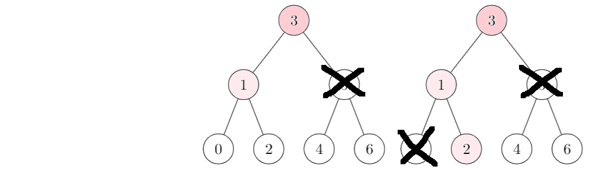

# Binary Search Tree (BST)

<div class="row row-cols-lg-2"><div>

A Binary Search Tree (BST) is a tree with each node having up to two children nodes. The complexity is $O{(n)}$, but, on average, we got $O{(h)}$ with $h$ the height of the tree.

The height is the length of the longest path from the root to a leaf.
</div><div>

* ✅: easy to learn, and easy to implement
* ✅: faster than an ordered list for `add`, `remove`
* ❌: slightly slower than an ordered list for `mem`, `get_min`
* ❌: [AVL trees](../avl/index.md) are improved BST
* ❌: Unless storing the cardinal, calculating it takes too much time

<details class="details-n">
<summary>Time comparisons - 500 000 values between 0 and 10 000</summary>

Test results of an implementation in [OCaml](/programming-languages/high-level/func/ocaml/index.md).

```text!
>>>>>>>>>> TIME FOR LISTS <<<<<<<<<<
Average time of add:                     0.000046
Average time of remove:                  0.000047
Average time for mem:                    0.002340
Average time for get_min:                0.001870
Average time for cardinal:               0.353290 (long)
>>>>>>>>>> TIME FOR BST <<<<<<<<<<
Average time of add:                     0.000002
Average time of remove:                  0.000002
Average time for mem:                    0.006270
Average time for get_min:                0.003290
Average time for cardinal:               inf (too long)
```
</details>
</div></div>

<hr class="sep-both">

## BST Add Example

<div class="row row-cols-lg-2"><div>

Example of adding a few elements:

* We are adding **2** in the empty tree
* We are adding **1**: **left** (1 < 2)
* We are adding **4**: **right** (4 > 2)
* We are adding **3**: **right** (3 > 2) **left** (3 < 4)
* We are adding **5**: **right** (5 > 2) **right** (5 > 4)
* We are adding **0**: **left** (0 < 2) **left** (0 < 1)

The idea is quite simple. To add an element `e`, for each node, starting from the root, we compare `e` with the current node's value `v`:

* if `e == v` then we don't add the node
* if `e > v` then we repeat the process on the right node
* if `e < v` then we repeat the process on the left node
* if there is no more right/left node, we add our node
</div><div>


</div></div>

<hr class="sep-both">

## BST Remove Example

<div class="row row-cols-lg-2"><div>

Example of removing a few elements:

* We are removing **3**: **4** is the new head
* We are removing **4**: **5** is the new head
* We are removing **6**
* We are removing **5**: **1** is the new head

We are always replacing the deleted node with the one at its right, unless there is none, in which case, we simply delete the node and replace it with its left child node <small>(if there is one)</small>.
</div><div>


</div></div>

<hr class="sep-both">

## BST Mem Example

<div class="row row-cols-lg-2"><div>

Example of checking if an element is within a tree:

Is `2` inside the tree?

* `2 < 3`: check left
* `2 > 1`: check right
* `2 == 2`: IN

If our element `e` is lower than the current node's value `v`, then we check the left node, otherwise we check the right node. If `e == v`, we found our element. An element is not in if we can't check the next location we were supposed to check <small>(no left/right child node)</small>.
</div><div>


</div></div>

<hr class="sep-both">

## Other common functions

<div class="row row-cols-lg-2"><div>

#### Minimum

The minimum is the bottom left value, e.g., the value
that was lower than every other value


</div><div>

#### Maximum

The minimum is the bottom right value, e.g., the value
that was greater than every other value


</div></div>