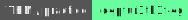

# Encoding

[](https://tryhackme.com/room/linuxstrengthtraining)
[](https://academy.hackthebox.com/course/preview/javascript-deobfuscation)
[](https://tryhackme.com/room/c4ptur3th3fl4g)

<div class="row row-cols-lg-2"><div>

Encoding 🖼️️ is a way of presenting data. Unlike encryption 🔒, anyone who can identify the algorithm used can decode the message.

A radix, or base, is a set of unique characters that we can use to encode a message. The most well-known ones are

* binary <small>(radix 2, $[0-1]$)</small>
* octal <small>(radix 8, $[0-7]$)</small>
* decimal <small>(radix 10, $[0-9]$)</small>
* hexadecimal <small>(radix 16, $[0-9]$ and $[A-F]$)</small>
* base32 <small>($[A-Z]$ and $[2-7]$ or $[A-V]$ and $[0-9]$)</small>
* base64 <small>($[A-Z]$ and  $[0-9]$ and $[+/]$ and "=" for padding)</small>

➡️ "Radix n" or "Radix-n" are both valid and commonly used.
</div><div>

**Some common rules** 📌

* In a $radix\ n$, values go from $0$ to $n-1$
* After 9, we are using letters
* After 35, we are using symbols
* ...
* $(n)_{k}$ means that the number $n$ is in a radix $k$

**Some tools to detect the encoding/decode/encode** 🚀

* [CyberChef](https://github.com/gchq/CyberChef) (21.2k ⭐) | [Online version](https://gchq.github.io/CyberChef/)
* [Burp Suite Decoder](/cybersecurity/red-team/s3.exploitation/tools/files/burp_decoder.md)
* [Decodify](https://github.com/s0md3v/Decodify) (0.8k ⭐)
* [binaryhexconverter.com](https://www.binaryhexconverter.com/)
* [rapidtables.com/base converter](https://www.rapidtables.com/convert/number/base-converter.html)
* [dencode.com](https://dencode.com/en/)
</div></div>

<hr class="sep-both">

## Division by base

<div class="row row-cols-lg-2"><div>

Division by base is a simple and straightforward way to convert numbers from one base to another.

* $a = \text{your_number}$
* $n = \text{your_radix}$
* do while $a > 0$
    * $q_i = \frac{a}{n}$
    * $r_i = a\ mod\ n$
    * $a = q_i$

The output is a set of $r_i$. You may have to convert them. For instance, $15$ will be converted to $F$. The final value is the concatenation of every $r_i$ **in the reverse order** (from the last to the first).

➡️ There are other techniques.
</div><div>

**Example** 🔥

* $a = 6072$
* $n = 15$
* do while $a > 0$
    * $q_0 = 6072 / 15 = 404$
    * $r_0 = 6072\ mod\ 15 = 12$
    * $q_1 = 404 / 15 = 26$
    * $r_1 = 404\ mod\ 15 = 14$
    * $q_2 = 26 / 15 = 1$
    * $r_2 = 26\ mod\ 15 = 11$
    * $q_3 = 1 / 15 = 0$
    * $r_3 = 1\ mod\ 15 = 1$
    * exit, $a$ is now 0

Then we convert $12=C$, $14=E$, $11=B$, and concatenating them in reverse order giving us $(6072)\_{10} = (1BEC)\_{15}$.
</div></div>

<hr class="sep-both">

## Radix 2 - 🖥️

<div class="row row-cols-lg-2"><div>

Radix 2, commonly called binary, is a base made of one and zero. It's the language used by machines 🖥️.

To convert a binary to a decimal, and vice versa, you need to know every power of two ($2^9 = 512 \ldots$).

| $2^8$ | $2^7$ | $2^6$ | $2^5$ | $2^4$ | $2^3$ | $2^2$ | $2^1$ | $2^0$ |
|-------|-------|-------|-------|-------|-------|-------|-------|-------|
| 256   | 128   | 64    | 32    | 16    | 8     | 4     | 2     | 1     |


**Every number can be expressed as a sum of powers of two.** If you use a power of two when expressing a number, then add a 0, else 1.
</div><div>

#### Radix 10 to Radix 2

* $125 = 64+32+16+8+4+1$
* $125 = 2^6+2^5+2^4+2^3+2^2+2^0$
* $125 = {\color{red} 1 *} 2^6+ {\color{red} 1 *} 2^5+ {\color{red} 1 *} 2^4+ {\color{red} 1 *} 2^3+ {\color{red} 1 *} 2^2 + {\color{green} 0 *} * 2^1 + {\color{red} 1 *}2^0$
* $(125)\_{10} = ({\color{red} 11111} {\color{green}0} {\color{red}1})\_{2}$

#### From Radix 2 to Radix 10

* $(1111101)\_{2}$
* There are 7 digits, so the first is $2^6$
* $1 * 2^6 + 1 * 2^5 + 1 * 2^4+ 1 * 2^3+ 1 * 2^2+ 0 * 2^1+ 1 * 2^0$
* $64 + 32 + 16 + 8 + 4 + 0 + 1$
* $125$
</div></div>

<hr class="sep-both">

## Radix 8 - 💀

<div class="row row-cols-lg-2"><div>

Radix 8, commonly called octal, is a base made of numbers from zero to seven. It's not commonly used  💀.

Radix 8 numbers may, or may not, start with a `0` (zero), such as `07`. The presence of this zero indicates that this is an octal number.

**3 binary digits are equal to one octal number.**

#### From Radix 8 to Radix 2

* Given $(175)\_{8}$
  * $(1)_8 = ({\color{grey}00}1)_2$
  * $(7)_8 = (111)_2$
  * $(5)_8 = (101)_2$
* Giving us $(175)\_{8}=({\color{grey}00}1111101)\_{2}=(1111101)\_{2}$
</div><div>

#### Radix 2 to Radix 8

* Given $(1111101)\_{2}$, we need 2 leading zeros
* $(001111101)\_{2}$
* Convert each group of 3 digits to radix 10 🔦
  * $(001)\_2$ is equal to $0+0+1=(1)_{10}$
  * $(111)\_2$ is equal to $4+2+1=(7)_{10}$
  * $(101)\_2$ is equal to $4+0+1=(5)_{10}$
* So we have $(1111101)\_{2}=(175)_{8}=0175$

➡️ We convert each group to radix 10, but it's the same as converting to radix 8, as the maximum value is 7. We say "radix 10" to avoid a recursive explanation.
</div></div>

<hr class="sep-both">

## Radix 16 - 🚀

<div class="row row-cols-lg-2"><div>

Radix 16, commonly called hexadecimal, is a base made of numbers from zero to 9, and letters from A to F. It replaced octal, and is the most popular way to write shorter binary numbers 🚀.

Hexadecimal numbers usually start with a `0x` ("zero x"), such as `0x7`.

**4 binary digits are equal to one hexadecimal number.**

##### Radix 10 and Radix 16

From 0 to 9, there are no changes. From 10 to 15, we use letters:

| 10  | 11  | 12  | 13  | 14  | 15  |
|-----|-----|-----|-----|-----|-----|
| A   | B   | C   | D   | E   | F   |
</div><div>

#### Radix 16 to Radix 2

* Given $(7D)_{16}$
  * $(7)_{16} = ({\color{grey}0}111)_2$
  * $(D)\_{16} = (13)\_{10} = (1101)_2$
* Giving us $(7D)\_{16}=({\color{grey}0}1111101)\_{2}=(1111101)\_{2}$

#### Radix 2 to Radix 16

* Given $(1111101)\_{2}$. We need 1 leading zero for 2 groups of 4.
* $(01111101)\_{2}$
* Convert each group of 3 digits to radix 10 then radix 16 🔦
  * $(0111)\_2$ is equal to $1+2+4=(7)\_{10}=(7)\_{16}$
  * $(1101)\_2$ is equal to $1+4+8=(13)\_{10}=(D)\_{16}$
* So we have $(7D)_{16}$ or $\text{0x}7D$
</div></div>

<hr class="sep-both">

## Base64 - ✉️

<div class="row row-cols-lg-2"><div class="align-self-center">

Base64 is usually used to encode an image/..., so that we can transfer it as a string. Most base64 strings are ending with "=", or "==", which is the padding.

* [base64encode](https://www.base64encode.org/)
* [base64decode](https://www.base64decode.org/)
</div><div>

```bash
$ echo "toto" | base64
dG90bwo=
$ echo "dG90bw=" | base64 -d
toto
```
</div></div>

<hr class="sep-both">

## URL encoding - 🌍

<div class="row row-cols-lg-2"><div>

URL encoding, also known as percent-encoding, is an encoding mostly used in URLs and resources, to encode characters that have a special meaning in URLs.

👉 See also: [urlencoder](https://www.urlencoder.io/).
</div><div>

* Example of encoding `%`
* Find the ASCII of `%`: `37`
* Convert the value to hexadecimal: `25`
* Add `%` before the result: `%25`
</div></div>

<hr class="sep-both">

## 👻 To-do 👻

Stuff that I found, but never read/used yet.

<div class="row row-cols-lg-2"><div>

* binary-coded decimal (BCD)
* Can put a file in cyber chef
  * Extract strings
  * Find/Replace to remove patterns
  * Drop bytes to remove chars
  * Defang URL (avoid clicking)
  * Extract URLs
</div><div>

<details class="details-e">
<summary><code>hexdump/xxd</code>: convert some text to octal/hexadecimal, and 🔁</summary>

* `-b`: to octal
* `-C`: to hexadecimal
* `-e`: customize

```bash!
$ hexdump <<< "Hello, World" > hello_world.hex
$ cat hello_world.hex
0000000 6548 6c6c 2c6f 5720 726f 646c 000a
000000d
# letters were mixed (WTF!!?)
$ echo -e "\x65"
e
$ echo -e "\x48"
H
# here it works fine
$ xxd <<< "Hello, World" | tee hello_world.hex
00000000: 4865 6c6c 6f2c 2057 6f72 6c64 0a         Hello, World.
# reverse
$ xxd -r hello_world.hex
Hello, World
$ sudo apt install xxd
$ xxd -p -rd <<< <SomeHexa>
```
</details>
<details class="details-e">
<summary><code>k#n</code>: convert a number $n$ in radix-$k$ to decimal</summary>

```bash
$ echo $[2#101] # 5
```
</details>
</div></div>