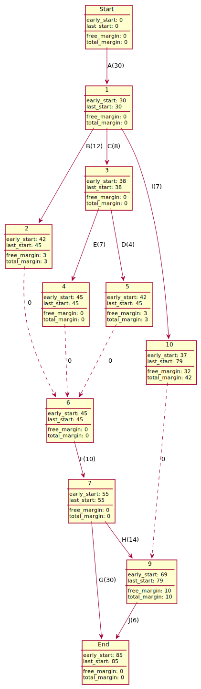

# Scheduling Problems Examples

## P.E.R.T. Example

Given the following tasks and their dependencies:

Detailed Explanations

**Explanations (dependencies)**

* Starting from Start
* The first task is $A(30)$ (since no previous tasks, cost=30)
* So we move to "1" with $A(30)$
* Then B, C, and I are **only** dependent on A, we are
  making their states like for "1".
* since D is dependent on A and C, and C is dependent on A, then we are making D dependent on state 3
* since we are entering state 10 with $I$ and state 9 is dependent (for $J$) from $I$, we are using a directed dotted arrow
* ...

Note: we removed (A, F), (A, D), (C, F) because of redundancy.

**Explanations (early/last start)**

* Start's early start value is always 0
* 1's early state is $0 + 30$ (previous + A cost)
* 6's early state is $38 + 4$ (previous 38 + D cost)
* ...

As for the last start, once we did all the early_start value, starting from the End

* End's last_start value is always the same as its early_start value
* 9's last_start is $85-6=79$ (End's last_start minus J cost)
* 3's last_start is $min(45-7, 45-4)=38$ (4's last_start minus E cost, and resp. 5's and D)
* ...

**Explanations (free/total margin)**

* The total margin is $\text{last_start-early_start}$
* 9's total margin is simply $79-69=10$
* 10's total margin is simply $79-37=42$
* ...

As for the free margin

* we are trying to get a total margin without changing the next early_date
* 9's free margin is $x + 69 + 6 \le 85 \Leftrightarrow x=10$
* 10's free margin is $x + 37 + 0 \le 69 \Leftrightarrow x=32$
* 5's free margin is $x + 42 + 0 \le 45 \Leftrightarrow x=3$
* ...

**Explanations (note)**

The critical path is $(Start, A, C, E, F, G, End)$.

The resulting P.E.R.T diagram is:

## Metra potential Example

Given the following tasks and their dependencies:

Detailed Explanations

**Explanations (dependencies)**

* this is straightforward
* C need A so $A \to C$ and A duration is 30 so the weight is 30
* D need C and A, but C needs A, so D only needs C (**redundancy**)
* F need A, B, C, D, and E, but B needs A, so F only needs B, C, D, E (**redundancy**)
* F need A, B, C, D, and E, but E needs C, so F only needs B, D, E (**redundancy**)
* ...

**Explanations (early/last start)**

* C early start is A early start + A cost: $0+30=30$
* D early start is C early start + C cost: $30+8=38$
* ...

As for the last start, once we did all the early_start value, starting from the End

* End's last_start is early_start value (always)
* J's last_start is $85-6=79$ (End's last_start minus J cost)
* C's last_start is $min(41-8, 38-8)=30$ (D's and resp. E's last_start minus C cost)
* ...

**Explanations (free/total margin)**

* The total margin is $\text{last_start-early_start}$
* J's total margin is simply $79-69=10$
* I's total margin is simply $72-30=42$
* ...

As for the free margin

* we are trying to get a total margin without changing the next early_date
* J's free margin is $x + 69 + 6 \le 85 \Leftrightarrow x=10$
* H's free margin is $x + 55 + 14 \le 69 \Leftrightarrow x=0$
* I's free margin is $x + 30 + 7 \le 69 \Leftrightarrow x=32$
* D's free margin is $x + 38 + 4 \le 45 \Leftrightarrow x=3$
* ...

**Explanations (note)**

The critical path is $(Start, A, C, E, F, G, End)$.

And the resulting Metra potential diagram is

