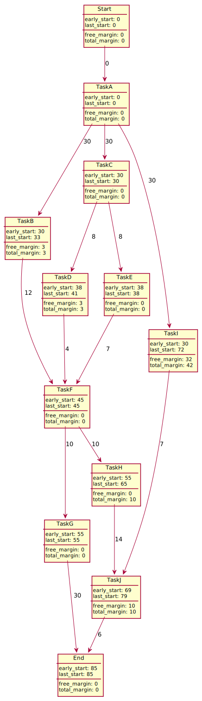

# Scheduling Problems Examples

## P.E.R.T. Example

Given the following tasks and their dependencies:

Detailed Explanations

**Explanations (dependencies)**

* Starting from Start
* The first state $1$ is achieved after completing $A(30)$
* $B$, $C$, and $I$ are **only** dependent on $A$, meaning they require the state $1$.
* $D$ is dependent on $A$ and $C$, meaning it requires the state $3$.
* Since we are entering state $10$ with $I$ and state $9$ is dependent (for $J$) from $I$, we are using a directed dotted arrow
* ...

Note: we removed (A, F), (A, D), (C, F) because of redundancy.

**Explanations (early/last start)**

* $Start$ early start value is always 0
* $1$ early state is $0 + 30$ <small>(previous + A cost)</small>
* $6$ early state is $38 + 4$ <small>(previous 38 + D cost)</small>
* ...

As for the last start, starting from the End:

* $End$ last_start value is its early_start value
* $9$ last_start is $85-6=79$ <small>(End's last_start minus J cost)</small>
* $3$ last_start is $min(45-7, 45-4)=38$ <small>(4's last_start minus E cost, and resp. 5's and D)</small>
* ...

**Explanations (free/total margin)**

* $9$ total margin is simply $79-69=10$
* $10$ total margin is simply $79-37=42$
* ...

As for the free margin:

* $9$ free margin is $x + 69 + 6 \le 85 \Leftrightarrow x=10$
* $10$ free margin is $x + 37 + 0 \le 69 \Leftrightarrow x=32$
* $5$ free margin is $x + 42 + 0 \le 45 \Leftrightarrow x=3$
* ...

**Explanations (note)**

The critical path is $(Start, A, C, E, F, G, End)$.

The resulting P.E.R.T diagram is:

## Metra potential Example

Given the following tasks and their dependencies:

Detailed Explanations

**Explanations (dependencies)**

* We create one vertex per task
* And we add every edge.
* As $C$ needs $A$, then we have $A \to C$. Since the duration of $A$ is $30$, then the weight is $30$.
* $D$ needs $C$ and $A$, but $C$ needs $A$, so $D$ only needs $C$ (**redundancy**)
* ...

**Explanations (early/last start)**

* $C$ early start is $A$ early start + $A$ cost: $0+30=30$
* $D$ early start is $C$ early start + $C$ cost: $30+8=38$
* ...

As for the last start, starting from the End

* $End$ last_start is early_start value
* $J$ last_start is $85-6=79$ <small>(End last_start minus $J$ cost)</small>
* $C$ last_start is $min(41-8, 38-8)=30$ <small>(D and resp. E last_start minus C cost)</small>
* ...

**Explanations (free/total margin)**

* The total margin is $\text{last_start-early_start}$
* $J$ total margin is simply $79-69=10$
* $I$ total margin is simply $72-30=42$
* ...

As for the free margin:

* $J$ free margin is $x + 69 + 6 \le 85 \Leftrightarrow x=10$
* $H$ free margin is $x + 55 + 14 \le 69 \Leftrightarrow x=0$
* $I$ free margin is $x + 30 + 7 \le 69 \Leftrightarrow x=32$
* $D$ free margin is $x + 38 + 4 \le 45 \Leftrightarrow x=3$
* ...

**Explanations (note)**

The critical path is $(Start, A, C, E, F, G, End)$.

And the resulting Metra potential diagram is

