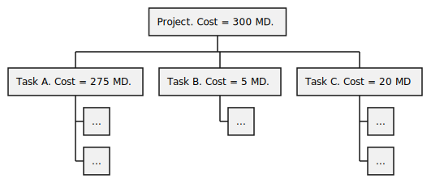

# Project Management

In a nutshell, a project involves:

* **Objectives** 🛣️: decipher and address client needs.
* **Deliverables** 📬: what you'll deliver to clients
* **Milestones** 📌: Key dates throughout your project timeline
* **Scope** 💵: Tasks, budget, and project-related elements
* **Resource Management** 📊: effort required for tasks (Man-days?)

A project usually involves two different teams:

* **Development Team** 🧑‍🔬: This is the initial group responsible for designing, coding, and implementing the project. They usually leave or move to another project after project completion.

* **Maintenance and Support Team** 🚵: This group takes over to ensure the project continued functionality, fix any issues that arise, and implement updates or improvements.

➡️ See also: Operational Maintenance and Security Maintenance.

## Specifications Document

It outlines the specifications that a project must meet. 

#### Overview

A simple specification document may include:

* **Introduce the company**: name, logo, background, etc.
* **Introduce the project**: client, needs, etc.
* **Introduce the target audience**: age, knowledge, etc.
* **Introduce the team**: members, roles, etc.
* **Introduce the graphic chart**: if you have one

#### Functional Specifications

This section focuses on the functionalities of the product. It could be a table with basic information about each task, along with their priority.

| N°| Task name | Duration (days) | Man-days | Priority |
| ------ | ------ | ------ | ------ | ------ |
|   | Phase1 | 20 | 85 | M |
| A | Task1	 | 8 | 25 | M |
| B | Task2 | 12 | 60 | C |

We often use MosCOW to determine the priority of each task:

* <kbd>M</kbd>: Must have this
* <kbd>S</kbd>: Should have this
* <kbd>C</kbd>: Could have this
* <kbd>W</kbd>: Would have this

You will have to further develop each task, by describing as much as possible, what must be done.

* You could design a mockup
* Don't forget error messages, events, animations/colors such as when a button is pressed, etc.
* Describe the task from the point of view of a user
* Define UML diagrams to formally define the task
* ...

#### Technical Specifications

The technical specifications define which languages, tools, and which technical constraints the development team will have.

* **Methods**: Agile-Scrum, Kanban, etc.
* **Technologies**
    * name (MariaDB? MySQL? Java? PHP? Etc.)
    * version (at least? Up to? Exact value?)
* **Platforms**: target platform(s)
* **Language**: French, English, etc.
* **Storage**: How do we manage persistence? (Database? File?)
* **Restrictions**: other restrictions, such as forbidding cookies.
* **Hardware**: are additional devices/components/... required?
* **Others**: version control, team communications, etc.

#### Risk Evaluation

You must evaluate the risks that may occur and determine how to handle them. It could be a person/tool/... that is not available, a task complexity that was incorrectly evaluated, a required dependency whose delivery was delayed, etc.

📚 See also: [Probabilistic risk assessment](https://en.wikipedia.org/wiki/Probabilistic_risk_assessment) and [Risk Matrix](https://en.wikipedia.org/wiki/Risk_matrix).

## Project Scheduling

#### Work Breakdown Structure (WBS)

WBS is a hierarchical decomposition of the tasks.  It's a breakdown of a project into smaller and more manageable components.

For each component, we usually add a duration, a cost, and optionally the result expected or the resources needed.

#### Scheduling Problems

Given a list of tasks and their dependencies, and the duration for each task, we want to create the best schedule.

Each task has the following properties:

* Early start time <small>(days before this task can be started)</small>
* Last start time <small>(maximum delay without impacting the expected duration)</small>
* Total margin <small>(maximum delay without impacting the expected duration)</small>
* Free margin <small>(maximum delay without impacting the dependencies start)</small>

Remove redundant transitive arrows. If we have $A \to C$, $C \to D$, and $A \to D$, we only need to keep $A \to C \to D$.

📚 In practice, we don't have the capability of having an unlimited number of tasks in parallel.

🛣️ To calculate the last start time, we start from the end, and we subtract each task duration.

See also: [Scheduling Problems Examples](_examples/scheduling.md).

 

#### Metra Potential Method

Create a [graph](/maths/graphs/index.md) with all tasks. The arrows are weighted with the duration of each task. 

#### P.E.R.T.

We will create a [graph](/maths/graphs/index.md). The vertices are an ordered set of numbers representing the states of the project, and each edge is a task.

On each edge, we add the name and cost of a task.

#### Critical path analysis

A critical path is a path of tasks that must not be delayed, otherwise, the whole project will be delayed. You can have more than one.

In both methods, it's the path with tasks that have the same value for the early and last start time properties.

#### Gantt chart

Gantt is a chart that illustrates a project schedule over time.

* [GanttProject](https://www.ganttproject.biz/download#download30) (software)
* [office timeline](https://www.officetimeline.com/) (website)

GanTTProject Notes

1. list all steps
2. sort and indent child tasks
3. create dependencies
4. set date and duration
5. add milestones
6. add your team
7. attribute tasks to your teammates

## Project Tools

#### Project Management Tools

* [Redmine](https://www.redmine.org/)

#### Bug And Issues Management Tools

* [YouTrack](https://www.jetbrains.com/youtrack/) (JetBrains)
* [Jira](https://www.atlassian.com/software/jira) (Atlassian)
* [GitHub Issues](https://github.com/features/issues), [GitLab Issues](https://docs.gitlab.com/ee/user/project/issues/), etc.
* [Redmine](https://www.redmine.org/)
* ...

## 👻 To-do 👻

Stuff that I found, but never read/used yet.

* Steering Meetings: for key stakeholders and decision-makers to provide guidance and direction for a project
* Periodic Meetings: at regular intervals, discuss ongoing work/challenges/progress.

Others

* Trendline, 45-Degree Line
* Lean Canvas
* Slack, Notion

Keywords and formulas for scheduling

* "optimistic time estimate" instead of total margin
* "normal time estimate" instead of free margin
* "pessimistic time estimate" instead of certain margin
* see deleted examples

Env

* Formation
* Prod
* Pre-prod (test with prod data)
* integration (with other software/...)
* quality control (functional)
* dev (continuous integration=>send your work=>tests=>deploy to envs=>continuous deployment)

