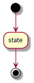
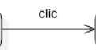
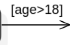
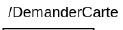
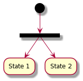

# Flow chart diagram

[Go back](../index.md)

This is a diagram representing all the states of the program and the conditions/triggers allowing the program to move from one state to another.

## States

When the program is starting, we are moving from one of the initial states to another state. Then we are moving from one state to another until one of the final states.

Inside "State", you could add attributes like

* ``entry/action`` where ``action`` is executed when entering this state
* ``exit/action`` where ``action`` is executed when exiting this state

## Transitions

Transitions are the arrows linking a state with another. You may add on the arrow,

* a trigger name (=event)

* a condition

* an action (executed when moving)

## Conditional branching

This is how you can do conditional branching.

You could write a condition instead of true/false. And, you can have more than 2 states branched by using that. The automaton will always take the most fitting condition like

* let x = 5
* cond1: x < 5
* cond2: x > 0
* cond3: x == 5
* then the branch we will take is the one having the condition cond3

Since not anyone may follow this rule, you may add a note saying how your automaton is picking a branch.

## Synchro bar

A synchro bar may be used if you want to both run State1 and State2 at the same time.

