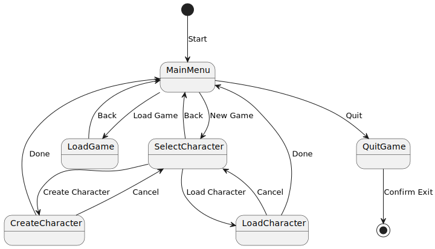

# Activity Diagram

Activity diagrams <small>(UML)</small> are often confused with Flowchart diagrams <small>(not UML nor specific to programming)</small> as they are similar 🗺️.

It represents every **state** 📍 of the program and how we **transit** ✈️ from one state to another.

For instance, in a game menu, we may have some states such as:

* MainMenu
* Load Game
* Select Character
* QuitGame

The transitions are the option we select to navigate between them.

## States

A state is literally a state of the program. There are 3 kinds of states:

* ⚽ Initial States
* 🧑 Intermediary States
* 🥅 Final States

When a program is starting, we are moving from one of the initial states to one of its linked intermediary states. We are moving between intermediary states until we reach a final state.

For instance, a program such as Word. We can run it and then open a file, or directly open a file when we run it. It means there are at least 2 initial states linking to `"Started"` and `"Editing a file"` respectively.

## 👻 To-do 👻

Stuff that I found, but never read/used yet.

* [_old](_old.md)

