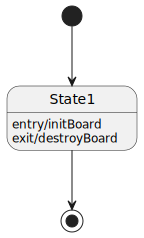
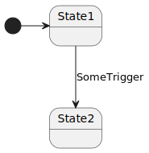
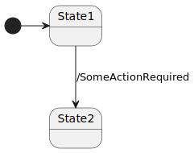
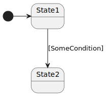
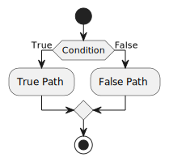
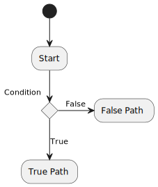
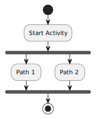

# Activity Diagram

Activity diagrams <small>(UML)</small> are often confused with Flowchart diagrams <small>(not UML nor specific to programming)</small> as they are similar 🗺️.

It represents every **state** 📍 of the program and how we **transit** ✈️ from one state to another.

For instance, in a game menu, we may have some states such as:

* MainMenu
* Load Game
* Select Character
* QuitGame

The transitions are the option we select to navigate between them.

## States

A state is literally a state of the program. There are 3 kinds of states:

* ⚽ Initial States
* 🧑 Intermediary States
* 🥅 Final States

When a program is starting, we are moving from one of the initial states to one of its linked intermediary states. We are moving between intermediary states until we reach a final state.

The initial state is represented as a solid black circle filled with black. The final state is represented as an empty black circle with a solid black circle filled with black inside.

Each state may contain some methods:

* `entry/action`: where `action` is executed when entering this state
* `exit/action` where `action` is executed when exiting this state

## Transitions

Transitions are the arrows linking a state with another. On each, you may add one of these:

* A trigger/event that we are waiting for

* An action that we are triggering and waiting for its end

* A condition such as `[money > 10€]`

#### Branching

Both syntaxes are used to use represent a branching. You can have as many branches and conditions as you want.

The most fitting condition if the one that will be used. You may add a note to ensure there is no doubt about it. A better approach is to only use `True` and `False` and chain them.

 

#### Synchronization bar

The synchronization bar is used when we want to do parallelism. The first indicates that the states below are executed in parallel (`fork`) and the second one indicate that we wait for all forks to terminate (`join`).

