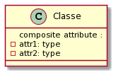
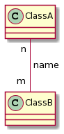

# Class diagram

* The class' name must starts with an uppercase, using CamelCase syntax <small>(upperCamelCase)</small>

Attributes

**Notes**

* if an attribute has a ``/`` before its visibility, this is a **derived attribute**, meaning that its value is calculated using other attributes.
* **composite attributes** are attributes made of more attributes. I have only seen that used in JavaScript, since you can create an object that does not have a class
  

## Associations and multiplicity

Now that you can write a class, we will look at the relationships between classes, represented by what we call associations/relationships. An association is a representation of a link between two classes. We usually write a multiplicity "n..m" characterizing how many instances of the classes are linked with how many of the other classes. We are also adding a name to remember what kind of link it is.

* [Multiplicity](content/multiplicity.md)
* [association classes](content/association-classes.md)
* an association from A to A is called self-association (``association réflexive``)
* you can add a direction
* adding a name on the association is optional
* you can have multiples associations between 2 classes

And sometimes you may declare an attribute having the type of another class inside your diagram. Some programmers are adding the attribute **on the association** rather than **inside the class**, but not everyone does this.

## Advanced associations

You are going to use the generalization a lot to factorize your code logic, aggregation/compositions are used a lot, but they aren't really useful.

* [generalization](content/generalization.md)
* [generalization - interfaces](content/interfaces.md)
* [generalization - abstract classes](content/abstract-classes.md)
* [aggregations](content/aggregations.md)
* [compositions](content/compositions.md)
* [multi-classes associations](content/multi-classes.md)

## Associations constraints

* **dynamic**: you write a note on the association, explaining the constraints (ex: you can't call buy before order)
  
The following constraints, are applied on every association **linked to a line ``------``**. We are adding the constraint on top of the line, which could be a constraint of

* **inclusion** ``{IN}, {SUBSET}, {I}``: if one association exist, then all of them exist too
* **exclusion** ``{X}``: if one association exist, then only one exist
* **equality/simultaneity** ``{=}, {AND}, {S}``: all associations must exist
* **total/coverage/inclusive** ``{T}, {OR}``: at least 1 association exist
* **partition/exclusive** ``{XT}, {P}, {+}``: only 1 association exist

For the constraint of inclusion, we are not drawing a line, but an arrow from the association X to the association Y. It means that X can only exist if Y exists.

## Packages

You can group classes by packages (=folders) to make something cleaner. Usually, a package name is a path, starting from the project folder. We are using ``.`` as the folder separator. You will usually see names like ``net.sourceforge.plantuml`` for the ``net/sourceforge/plantuml/`` folder.

