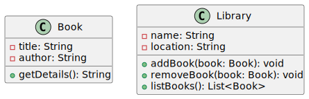
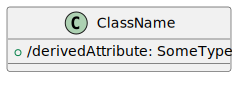
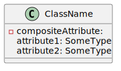
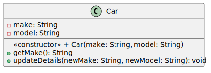
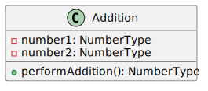
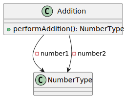
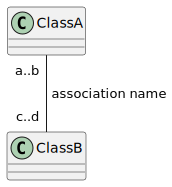
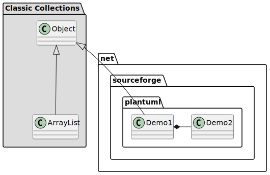

# Class Diagrams

A class diagram is used to represent the structure of a system. It's mostly used for [object-oriented](/programming-languages/_paradigm/oo.md) modeling.

It's abstract and the concrete version is called an [object diagram](../object/index.md). Creating an object from a class is called **instantiation**.

A **class** 🏡 is an abstract representation of a concept, such as a Book or a Person. Each class has:

* **attributes** 🎫: these are the data properties of a class. For instance, a title.
* **operations** 🏭: these are the behaviors that concepts can perform. For instance, from a book, we can get its details <small>(using getDetails)</small>.

There are also **associations** 🛣️ which represent the relationships between concepts (e.g., classes). There are none in the example.

## Basics syntax

We use "member" to refer to both attributes and operations.

#### Modifiers

Each member can have a [modifier](/programming-languages/_paradigm/oo.md#access-control) <small>(explicit or not)</small> which is something to limit who can access an attribute or an operation.

* `+` is for public
* `-` is for private
* `~` is for package
* `#` is for protected

 

#### Class Members

Class members <small>(a.k.a. `static` members)</small> are attributes and methods that are shared across every instance.

They are commonly used for constants attributes, utilities...

In UML, such members are **underlined** 🌵.

...

## Overview

#### Classes

Classes are made both of attributes and methods separated by a line. The name of the class must always start with an uppercase.

#### Attributes

Each attribute must have at least a name and a type. It may have a modifier and a default value.

You can have OCL constraints such as `{final}` right-after the attribute.

* Derived attributes

Derived attributes are attributes whose values is calculated using other attributes. They are usually created for convenience.

* Composite attributes

Composite attributes are attributes composed of multiple attributes. 

#### Operations

Each attribute must have at least a name followed by parenthesis. It may have a modifier, parameters <small>(comma-separated)</small>, and a return type.

⚠️ No return type is NOT the same as `void`.

📝 Methods can be annotated: `<<constructor>>` or `<<destroy>>`.

## Associations and multiplicity

Associations represent which classes are linked to which other classes.

&nbsp;&nbsp;&nbsp;

Associations are not necessarily representing attributes while most do.

...

## Packages

Packages are used to group and sort classes.

## 👻 To-do 👻

Stuff that I found, but never read/used yet.

* [_old](_old/index.md)

