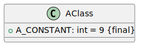

# Class Diagrams

A class diagram is used to represent the structure of a system. It's mostly used for [object-oriented](/programming-languages/_paradigm/oo.md) modeling.

It's abstract and the concrete version is called an [object diagram](../object/index.md). Creating an object from a class is called **instantiation**.

A **class** 🏡 is an abstract representation of a concept, such as a Book or a Person. Each class has:

* **attributes** 🎫: these are the data properties of a class. For instance, a title.
* **operations** 🏭: these are the behaviors that concepts can perform. For instance, from a book, we can get its details <small>(using getDetails)</small>.

There are also **associations** 🛣️ which represent the relationships between concepts (e.g., classes). There are none in the example.

## Basics syntax

We use "member" to refer to both attributes and operations.

#### Modifiers

Each member can have a [modifier](/programming-languages/_paradigm/oo.md#access-control) <small>(explicit or not)</small> which is something to limit who can access an attribute or an operation.

* `+` is for public
* `-` is for private
* `~` is for package
* `#` is for protected

 

#### Class Members

Class members <small>(a.k.a. `static` members)</small> are attributes and methods that are shared across every instance.

They are commonly used for constants attributes, utilities...

In UML, such members are **underlined** 🌵.

...

## Overview

#### Classes

Classes are made both of attributes and methods separated by a line. The name of the class must always start with an uppercase.

#### Attributes

Each attribute must have at least a name and a type. It may have a modifier and a default value.

You can have OCL constraints such as `{final}` right-after the attribute.

* Derived attributes

Derived attributes are attributes whose values is calculated using other attributes. They are usually created for convenience.

* Composite attributes

Composite attributes are attributes composed of multiple attributes. 

#### Operations

Each attribute must have at least a name followed by parenthesis. It may have a modifier, parameters <small>(comma-separated)</small>, and a return type.

⚠️ No return type is NOT the same as `void`.

📝 Methods can be annotated: `<<constructor>>` or `<<destroy>>`.

## Associations and multiplicity

Associations represent which classes are linked to which other classes.

&nbsp;&nbsp;&nbsp;

Associations are not necessarily representing attributes while most do.

* There could be multiple associations between two classes
* You can add arrows if the association is unidirectional. By default, there is no associations meaning it's bidirectional.

 

#### Multiplicity

The multiplicity indicates how many instances of a class are associated with instances of another class.

* There are **a..b** instances of **B** associated with **A**.
* There are **c..d** instances of **A** associated with **B**.

List of possible values

* <kbd>n</kbd>: same as <kbd>n..n</kbd>
* <kbd>*</kbd>: same as <kbd>0..\*</kbd>
* <kbd>0..1</kbd>: 0 or 1
* <kbd>0..*</kbd>: same as <kbd>\*</kbd>
* <kbd>1..*</kbd>: 1 or more
* <kbd>n..*</kbd>: <kbd>n</kbd> or more
* <kbd>n..m</kbd>: at least <kbd>n</kbd>, and up to <kbd>m</kbd>
* <kbd>n..n</kbd>: exactly <kbd>n</kbd>

For instance, we could replace <kbd>a..b</kbd> with <kbd>0..1</kbd> <small>(meaning 0 or 1)</small> or with <kbd>*</kbd> (0 or more).

...

## Packages

Packages are used to group and sort classes.

## 👻 To-do 👻

Stuff that I found, but never read/used yet.

* [_old](_old/index.md)

