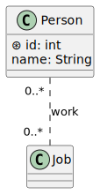

# Database Diagram

A database diagram seems to be an unofficial diagram mostly based on a simplified [Class Diagram]() with some semantic changes.

XXX:

* Classes, Methods, Attributes
* Associations and multiplicity
* Generalization and inheritance

## 👻 To-do 👻

Stuff that I found, but never read/used yet.

...

