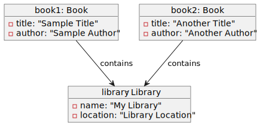

# Object Diagram

An object diagram is a concrete version of a [class diagram](../class/index.md). It means we are instantiating classes into `variables` and we are giving values to all attributes. Associations are instantiated into links.

**Some notes** 📝

* The object name is underlined
* Links are indicating which variable "contains" <small>(here, the association is called "contains")</small> others

