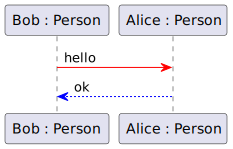

# Sequence Diagram

There are two categories of sequence diagrams. They serve a different purpose and have a different scope 🗺️.

The first ones are **System Sequence Diagrams** (SSDs) 🪛. They are used during the early stages of the design. They represent the high-level interactions between actors <small>(ex: a person)</small> and systems <small>(ex: a shop)</small>.

On the other hand, a **Detailed Sequence Diagram** (DSD)is a visual representation of [a use case](../use_case/index.md) with all its detailed interactions.

For instance, "Player engages in combat with an enemy character."

💡 When we refer to a "Sequence Diagram", we usually refer to a Detailed Sequence Diagram.

## Basic Overview

Sequence Diagrams focus on the chronological order interactions among systems or actors. They illustrate the **lifetime** of all entities ⏳.

The diagram is read from the top to the bottom, representing time progressing from top to bottom ⌛.

Each **participant** in the sequence can be:

* An actor <small>(refer to [Use Case Diagrams](../use_case/index.md))</small>
* A class <small>(refer to [Class Diagrams](../class/index.md))</small>
* An object <small>(refer to [Object Diagrams](../object/index.md))</small>
* ...

This is determined by the level of abstraction needed. Below, we have an object diagram with two instances of `Person`.

The vertical dotted line is what we call a **lifetime**.

The interactions between participants are called **messages** 📮. You can view it as the same as `function` calls.

The solid line and arrowhead represents a message <small>(ex: a function call)</small>. The rectangle is an **activation bar**. It means the participant is active <small>(ex: executing our function)</small>. The dashed arrow is the **reply** <small>(ex: return xxx)</small>.

Some messages are **asynchronous** meaning we are not expecting a response meaning the timeline doesn't wait for a reply to continue. They are represented with a different arrowhead.

👉 For complex diagrams, we may add numbers before every message especially when it involves asynchronous messages.

## Combined Fragments

[Combined Fragments](https://www.uml-diagrams.org/sequence-diagrams-combined-fragment.html) are used to add various types of control flow and interaction scenarios within a sequence diagram.

Conditions such as `[isXXX]` are called **guards**.

Most combined fragments with guards can have a variable number of blocks. Simply add a dotted line and a guard to the new block.

 

#### Combined Fragments: ALT and OPT

Both are used for branching. `ALT` is for alternative behavior <small>(execute one of...)</small> while `OPT` is optional behavior <small>(execute if condition met)</small>.

 

#### Combined Fragment LOOP 

You can repeat some interactions multiple times.

#### Combined Fragments: PAR, SEQ/STRICT, CRITICAL

First, `PAR` is used to run instructions in parallel. `SEQ` or `STRICT` are used when we are calling asynchronous methods, and we need to ensure the previous one is done before the next one <small>(STRICT doesn't propagate)</small>.

🐫 I learned that `CRITICAL` means that the instructions mustn't fail but documentation says it doesn't mean that <small>(it means an atomic instruction)</small>.

 

#### Combined Fragments "SD" and "REF"

I can't seem to find the documentation for both. Usually, sequence diagrams are wrapped in a combined fragment `sd diagram_name`.

This allows us to use the `ref` to import them.

 &nbsp;

## 👻 To-do 👻

Stuff that I found, but never read/used yet.

* self messages
* example with fully instantiated diagram
* we can't get a reply without sending a message first
* ensure target function existing on target ; link class diagram
* "create", "destroy"...
* cross at the end of a timeline = destroy
* instantiated vs non-instantiated (cf scenarios)

