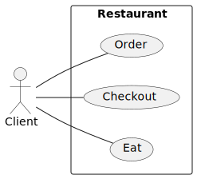
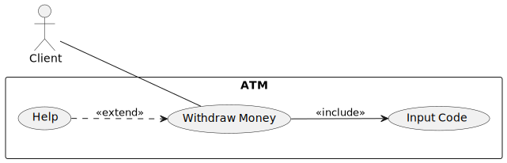

# Use Case Diagram

An Use Case Diagram is used to visualize the functionality of a **system** 🏠 <small>(ex: a restaurant)</small> from the perspective of its **actors** <small>(ex: a client)</small> 🧑.

Each of `Order`, `Checkout` and `Eat` are called **use cases** 🎫 and represent what the **actors** 🧑 can do within the **system** 🏠. The arrows between both are called **associations** 🌿.

An actor can be another system. For instance, the restaurant is interacting with providers, so we will another another diagram with "restaurant" as an actor and "Provider" as a system.

It's not a temporal diagram, e.g., it doesn't represent actions that can be performed after performing another action first.

## Associations

Associations are complex. They are only present between the actors and the use cases that the actor "**intends**" to do 📚.

For instance, if a client is trying to withdraw some money but they forgot how to, they will read the help. But, they won't come, read the help, and leave, so there is no association between client and help.

## 👻 To-do 👻

Stuff that I found, but never read/used yet.

* [_old](_old.md)

