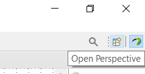
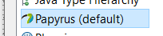
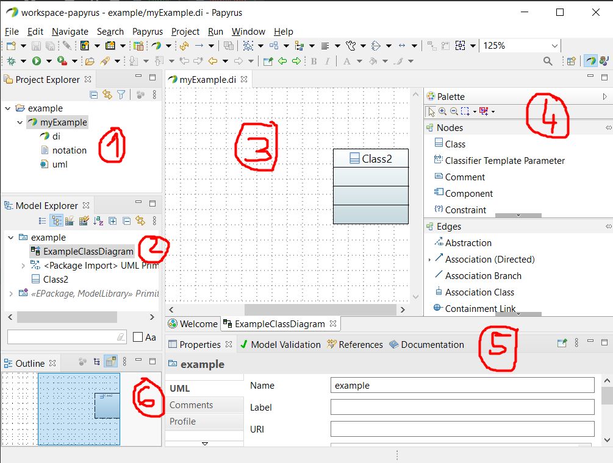
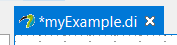
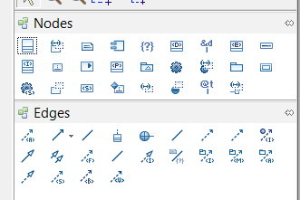
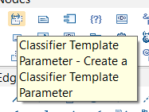
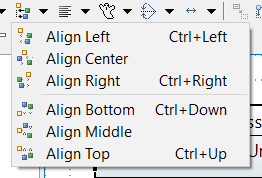
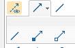
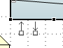
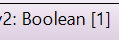

# Papyrus

[Papyrus](https://eclipse.dev/papyrus/index.php) is an open-source UML tool based on Eclipse. It's a multipurpose software allowing us to:

* 🤔 Design UML 2 diagrams
* 🏭 Generate code from diagrams
* 🛣️ Simulate your diagrams
* 👀 Connect diagrams and write meta-models
* ...

You can download it [here](https://eclipse.dev/papyrus/download.html). These notes are based on [4.8.0](https://www.eclipse.org/downloads/download.php?file=/modeling/mdt/papyrus/rcp/2020-06/4.8.0/papyrus-2020-06-4.8.0-win64.zip).

To install Papyrus, you need to install [Java](https://www.oracle.com/java/technologies/downloads/) first. If you have problems when starting Papyrus, check out [this video](https://www.youtube.com/watch?v=QlGrBHkwDXQ&ab_channel=GameTrick).

Once the software is started, create a **new papyrus model**. A model is made of 3 files: `xxx.di`, `xxx.notation`, and `xxx.uml`.

⚠️ Their software may be buggy at times and crash. Make sure to often save your diagrams and keep copies of your work.

## Core concepts

#### Model

All diagrams are parts of a **model**. It allows us to connect diagrams and reuse what we defined in other diagrams between diagrams.

If you change the model, it will be changed everywhere.

 

#### View and model

**The Model explorer is the only thing you can trust.**

The view may change and the model may not. It may occur if you try to rename something and the new name is invalid.

#### Perspectives

Perspectives allow you to view your model from different perspectives. Ensure that you are using the Papyrus perspective when you are creating models.

 and select 

If you use a perspective at least once, a shortcut will be available right next to the perspective menu. See also:  "Window > Perspective".

## Papyrus Interface

1. **Project explorer** 📂: Double-click on a model to open it
    * Export your diagrams <small>(right-click on model -> export)</small>
    * Open your project in the file explorer <small>(right-click on the folder "example" and "show in")</small>
2. **Model explorer** 🍀: Once you opened a model, add diagrams inside it from here: Right-click on "example" > "New diagram".
3. **Model editor** 🎥: edit your diagram here. You can move things from the palette (4) to here.
4. **Palette** 🎨: everything element that you can put inside the kind of diagram you opened.
5. **Property view** 🔐: Edit the properties of what you selected
    * ex: give another name to a class
    * ex: give a type to an attribute
    * ex: write some documentation
    * etc.
6. **Outline view** 🌍: you can move faster in the model editor view using the Outline tab.
    * You can use it to view your diagram from afar
    * You can change the outline view <small>(by clicking on the tree-like icon)</small> to see your model as a tree

## Tips and recommendations

#### Don't scroll in the property view

You can scroll to change the values of a field <small>(such as checked -> uncheck, or the type of your attribute, etc.)</small> when you are in the **Property view**. 

Unfortunately, you can't control it: you might change something or cancel everything you did by mistake ⚠️.

 

#### Modified file symbol

It's common, but there is a little star before every edited filename.

 

#### Icons for Palette

The palette has quite a lot of elements. It's fasted and easier to change the palette view to a list of icons <small>(Right-click to change the view)</small>.

#### Dark Mode

Navigate to `Window > Preferences` and set your settings.

 

#### Fast creation of items

From the palette, you can double-click on something to create a new element, there is no need to drag-and-drop it.

 

#### Align items

It's kinda useless but to create nicer diagrams, you may use "align" to cleanly arrange items of a diagram.

Either by using this icon or <kbd>CTRL+{some arrow}</kbd>, **after selecting elements**, you can align every class based on the position of the last selected class. You can use "distribute" too.

## Class diagrams in Papyrus

#### Associations

When selecting an association, directed associations are created by default. After using an undirected association, it will use these.

After creating an association, in the **Property view** you can add a direction, set the multiplicity, transform it to a composition or aggregation, etc. rather easily.

Near the corners of a class, wait a bit while your mouse is on a class and a shortcut to create associations will pop:

#### Interfaces

As a reminder:

* ➡️ If a class implements/realizes an interface, then the head of the arrow is on the interface.
* ➡️ If a class extends/generalize another class, then the head of the arrow is on other class.

#### Types

When clicking on an attribute, there is a field "Type" inside the Property View. Click on "... > Tree > EPackage Primitive Types" and select your type.

**Notes**

* "Boolean [1]" after the type mean that the **cardinality** is **1** <small>(=this is a value, more than 1 means this is an array/a list/a queue/...)</small>
* You could drag and drop a class inside the field, instead of picking a primitive type.
* If you need to create a new type, use either `DataType` <small>(cannot be instanced)</small> or `Primitive type` or a class if none are what you want

#### Layout/Appearance

You can right-click on a class:

* **Reformat**: reformat what you selected
* **Filter**: show/hide attributes/operations/...
* You can also give colors to classes
* ...

## Code Generation

#### Install deps

You need **papyrus.designer**, **Xtend IDE**, and **acceleo**.

papyrus.designer

* Help > Install New Software
* Enter `https://ci.eclipse.org/papyrus/job/papyrus-designer-2020-06/lastSuccessfulBuild/artifact/releng/org.eclipse.papyrus.designer.p2/target/repository/` and press enter
* Select the first `Papyrus base elements for code generation`
* Select the first `Papyrus Java profile ...`
* Next (wait)
* Next
* "I accept" and Finish <small>(wait, check the bottom right of papyrus)</small>
* Restart <small>(when prompted)</small>

You'll then have to download a plugin for code generation:

Xtend IDE 🍬

* Help > Install New Software
* Enter `https://download.eclipse.org/modeling/tmf/xtext/updates/composite/latest/` and press enter
* Select Xtend IDE inside XText
* Next (wait)
* Next
* "I accept" and Finish <small>(wait, check the bottom right of papyrus)</small>
* Restart <small>(when prompted)</small>

Acceleo 🍫

Acceleo only generates code from class diagrams.

* Help > Install New Software
* Enter `https://download.eclipse.org/acceleo/updates/releases/3.7/R201911060712` and press enter
* Select Acceleo in Acceleo
* Next (wait)
* Next
* "I accept" and Finish <small>(wait, check the bottom right of papyrus)</small>
* Restart <small>(when prompted)</small>

#### Improve the generation

Acceleo improvements

Get started by opening the file: `/org.eclipse.acceleo.examples.uml2java/` > src > `/org/eclipse/acceleo/examples/uml2java/main/uml2java.mtl`.

#### Runtime Eclipse

* Run > Run Configurations (or Debug Configurations)
* Double-click on Eclipse
* You may name the configuration "runtime_eclipse"
* Press Run (resp. Debug)
* And click on **proceed** if prompted.

#### Process With Code Generation

Inside the Runtime Eclipse:

* Import projects
* Existing Projects Into Workspace
* Browse > Find SMModel
* Once imported, double-click on the model

For **Xtend** 🍬, in the Model Explorer:

* Right-click on "Project XXX" <small>(your project)</small>
* Generate Code for State Machine
* Create JDT <small>(Yes > Set JDK to XXX > Finish)</small>

For **Acceleo** 🍫, in the Project Explorer:

* Expand "Project XXX" <small>(your project)</small> to see the UML file
* Right-click on the UML file
    * Acceleo Model To Text
    * Generate UML2java
* You got a folder **src-gen**

It will generate a new model with the generated Java classes 👑.

## 👻 To-do 👻

Stuff that I found, but never read/used yet.

* [_IGL](igl/index.md)
* [Papyrus CEA Guide](https://www.eclipse.org/papyrus/resources/TutorialOnPapyrusUSE_d20101001.pdf)
* Warning: do not create an activity twice (use sync with editor, navigate to find it)
* Warning: in activities, every call must be Typed

