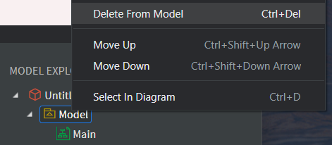
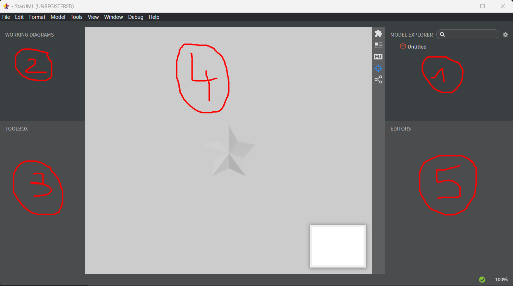

# StarUML

[StarUML](https://staruml.io/) is a simple yet complete free UML design tool. 

* It supports the concept of **Models** 🏘️
* It supports more than 20 types **diagrams** 🚀
* It supports **many symbols/elements** for each diagram 👌
* It has many **plugins** 🕹️ ; albeit some are not updated
  * UML to OpenAPI <small>(An API Specification)</small>
  * UML to Code <small>(C#, SQL, Python, TypeScript, Java, C++...)</small>
  * Code to UML <small>(C#, Java, C++...)</small>
  * ...
* ...

But it also has some bugs, including some annoying ones 🐛.

Once you installed the software and run it. To start from a clean environment, click on "Model" and select "Delete From Model".

👉 StarUML projects files are `.mdj` files <small>(models + diagrams)</small>.

## Editor Overview

The editor is divided in five Windows.

1. **Model Explorer** 🌱: a Model is a collection of diagrams. You can reuse something from a diagram in another diagram.

2. **Working Diagrams** 📇: all recently opened diagrams

3. **Toolbox** 🪛: UML elements available for the opened diagram

4. **View** 🖼️: the opened UML diagram. Click on an element from the toolbox and click somewhere in this window to add it.

5. **Editor** 🧑‍🍳: you can manipulate UML elements properties or add additional information such as documentation.

➡️ In the Model Explorer, the "Untitled" is the project name.

## 👻 To-do 👻

Stuff that I found, but never read/used yet.

xxx

