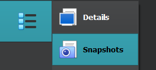

# VirtualBox

VirtualBox is a popular free virtualization software.

* [Download VirtualBox](https://www.virtualbox.org/)

You may need to install Virtual Box Extension pack later

* <kbd>Help > About Virtual Box</kbd> to find your version
* [Download Virtual Box Extension pack](https://download.virtualbox.org/virtualbox/) <small>(version/xxx.vbox-extpack)</small>
* File > Tools > Extension Pack Manager > Install

* ✨ You can create shared folders between host and VM
* ✨ You can copy/paste to/from the VM
* 🏪 You can take snapshots
* 🪲 There are many bugs/the UX is pretty bad
* 🔥 You can configure many things
* 👎 Lack of ways to import/export VMs from/to VMWare

## Random features

#### Take a snapshot

Click on the menu icon next to your VM,  and select "Snapshot".

➡️ To avoid problems, you should do it when the VM is off.

➡️ If the machine is started, you can also use the menu <kbd>Machine > Take Snapshot...</kbd> for the menubar.

#### Shared keyboard/folder

Right-click on a machine, and open Settings. 

* In General > Advanced, you can enable bidirectional keyboard
* In Shared folders, you can create shared folders

Additionally, for Windows VMs

* Start the machine
* Select <kbd>Device > Insert Guest Additions CD...</kbd>
* Install the software on the CD
* Restart

## Random notes

#### Bug: no automatic mouse integration

By default, you can freely use your mouse between your host and your virtual machine. But, I had a bug 🪲, when restarting a machine close using "save instance state", in which my mouse was not detected anymore.

➡️ My "patch" is to lock the VM before closing it.

#### Bug: bidirectional keyboard not working

➡️ Try restarting the VM.

