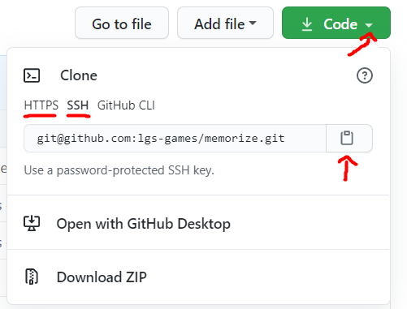

# git clone

[Go back](../index.md#basic-usage)

You can get a project from the server using this command `git clone`.

```bash
git clone URL
```

To get the ``URL``, you can do something like this on the page of your repository



* click on the arrow
* choose ``SSH`` (no login, if you configured ssh keys) or ``HTTPS`` (always login)
* then copy the link, that's your ``URL``

<hr class="sl">

## git init

You can create a repository from existing files using `git init`, with URL the same as above.

```bash
git init
git remote add origin URL
```

<hr class="sr">

## git remote

You can **switch to another URL** using `git remote`, such as switching from ``HTTPS`` to `SSH`.

```bash
git remote set-url origin new_url
```

