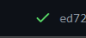
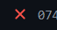

# Actions

[Go back](../index.md#advanced-concepts)

Actions are some code that is run each time you make a commit or a pull request. For instance, you could create an action that will verify that your code compiles on some specific platform that you configured.

* : all checks passed
* : at least a check failed

You can check [GitHub's actions](https://github.com/features/actions) page and the [GitHub actions tutorial](https://docs.github.com/en/actions/quickstart). On GitHub (and maybe ...), the files for an action are generated, so most of the time, you're able to configure one easily. 

<hr class="sl">

## Note: Action for multiples repositories

I had a project (which I deleted), that was having other repositories inside. When you `git clone` the repository, you also need to clone the nested repositories.

```yaml
    # filling the folder other-repository-folder-name
    # with the content from URL/repository.git
    - run: git clone URL/repository.git other-repository-folder-name
```

<hr class="sr">

## Note: Action for Java

If you're making a project in Java, you need to install Java on the machine on which the code will be run (😎). You can do it using [actions/setup-java](https://github.com/actions/setup-java).

```yaml
    - name: Set up JDK 16
        uses: actions/setup-java@v2
        with:
          java-version: '16'
          distribution: 'adopt'
```