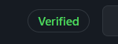

# About this course

* you will learn what's git
* the basic usage of git
* the main concepts
* good practices
* some advanced concepts

This course will strongly refer
to [Github](https://github.com/)
but you may also check

* [GitLab](https://about.gitlab.com/), the most well-know alternative to Github
* [Gogs](https://gogs.io/), open-source, self-hosted

As a student, you may enjoy the benefits
of the 
[GitHub student pack](https://education.github.com/pack).

<hr class="sr">

## Introduction

Git is a great tool that allows users to work on
one project together, by allowing things as

* **commits**: a save of your project
* **branch**: duplicate your project to continue
developing without breaking the ``main`` version
before **merging** all your changes into your
  ``main`` version.

So first of all, you need to

* [set things up locally](local-install.md)
* [set things up server-side](server-install.md)

<hr class="sl">

## Basic usage

Please take note that all ``commands`` start with
``git`` then one space.

* [Get your repository from server](commands/clone.md)
* [Update your local version](commands/pull.md)
* [Save your local changes](commands/commit.md)
* [Send your changes to the server](commands/push.md)
* [Check the git status](commands/status.md)

So to summarize, a basic usage would be

```bash
# 
# Only done once, download the repository locally 
#
git clone "https://github.com/lgs-games/memorize.git"

# Then inside the folder, you can do

# get the latest version on the server
git pull
# ... work a lot ...
# check what's changed
git status
# save your changes
git add .
git commit -m "I worked a lot"
# then send your changes to the server
# (or not and repeat add/commit)
git push
```

<hr class="sr">

## Main concepts

Here are commands that you will use on a project
so most likely all the time if you are not working
alone or for yourself.

* ``git branch name``: create a branch
* ``git checkout name``: move to a branch
* ``git merge``: merge the current branch with the main/master branch

So let's now explain what's a branch. By default, you are
coding on a branch called ``master`` (or sometimes `main`).

You may want to create a copy of your project, modify it
then merge your changes into your original code
(or just drop it since you changed your mind).

That's what we can do with ``branch`` and `merge`.
Simply create a branch, move on it, code, then ``merge``
it into ``master`` or just destroy it.

> As a side note, a lot of time they are conflicts
> with ``merging`` meaning someone modified master
> while you were working on it. Simply check
> all the conflicting files and choose what you
> want to keep. Some software provides you
> an interface to do that quite easily such
> as ``IntelliJ IDEA``.

<hr class="sl">

## Good practices

**Atomic commits**: one commit means one change, such
as adding one functionality. Do not make hundreds of changes
making it hard to find what you did in a commit.

**Short-Long description**: you can, and should make
a short and a long description of your commits
like that

```bash
git commit -m "a short inline description

A long description, where I describe
all of my changes
"
```

**README.md**: put a README in all of your projects, that
the start of a great adventure.

**LICENSE**: you may also put a LICENSE even if you don't
want to put restrictions on your code, to protect yourself
from complains (MIT LICENSE
is good for that). You should check
[this link](https://choosealicense.com/).

**.gitignore**: you may not want to commit some files
like high-churn ones or big files... Create a file
called "gitignore" is a good practice, you can

* generate one [here](https://www.toptal.com/developers/gitignore).
* use a template [here](https://github.com/github/gitignore)

<hr class="sr">

## Advanced Github concepts

Here are some functionalities
that you can find on Github (but you may find them too somewhere else).

* [Wikis](github/wiki.md)
* [Actions](github/actions.md)
* [PullRequests](github/pull-requests.md)
* [Issues](github/issues.md)
* [Organizations](github/organizations.md)
* [Pages](github/pages.md)

<hr class="sl">

## Commits

You may have seen some commits with
this label on some (if not all) commits



You can sign your commits and have this too using
[GPG keys](https://docs.github.com/en/github/authenticating-to-github/managing-commit-signature-verification/generating-a-new-gpg-key)
(GitHub tutorial). You will need to write
a passphrase each time you are committing but you
can reduce the number of times asked 

* [help on stackoverflow](https://stackoverflow.com/questions/38384957/prevent-git-from-asking-for-the-gnupg-password-during-signing-a-commit)
* [gpg-agent.conf](https://gist.github.com/tknv/43604e851a371949343b78261c48f190)

Also, someone can commit on the behalf
of someone else (not related to GPG)

* [authored / committed](https://stackoverflow.com/questions/25327743/what-flow-causes-github-commits-that-are-authored-by-one-user-but-committed)

<hr class="sr">

## Heroku

[Heroku](https://www.heroku.com/home) 
is a sort of GitHub action for automatic
deployment. Currently, there are not that many languages
supported but still you may want to check it out.
They have a [student](https://www.heroku.com/github-students)
offer if needed.

The short videos on their website
like [this one for nodejs](https://www.heroku.com/nodejs)
are showing exactly what Heroku is doing.

<hr class="sl">

## Fancy notes

Did you hear about badges? You can find them in the 
README.md in a lot of repositories.


They are loaded with the latest value like the real license
here so devs add them into a README to help others
to easily a lot about their repository.

* [shields.io](https://shields.io/): a lot of badges,
  you can even create yours
* [badgen.net](https://badgen.net/): follows the steps
and get some badges

You can check websites like these for reviews of your
code

* <https://sonarcloud.io/> (the BEST, quite a lot of feedback)
* <https://www.codefactor.io/> (analysis, good)
* <https://www.codetriage.com/>
* <https://about.codecov.io/> (code coverage)
* <https://weblate.org/fr/>
* <https://snyk.io/> (vulnerabilities)
* <https://www.codacy.com/> (I didn't manage to install this one)
* <https://lgtm.com/> (basic feedback)
* <https://scrutinizer-ci.com/> (paid)

You may also check this to create a profile card

* <https://github.com/anuraghazra/github-readme-stats>


You can also show an achievements badge


And you can even find things like joke cards
<https://readme-jokes.vercel.app/api>.

You can also **create a skyline** with your
contributions using <https://skyline.github.com/>.

<hr class="sr">

## Sources

* [github git guide](https://github.com/git-guides/)
* [changing remote](https://docs.github.com/en/github/using-git/changing-a-remotes-url)
* [add ssh key](https://docs.github.com/en/free-pro-team@latest/github/authenticating-to-github/generating-a-new-ssh-key-and-adding-it-to-the-ssh-agent)
* [good practices](http://adopteungit.fr/methodologie/2017/04/26/commits-atomiques-la-bonne-approche.html)
* [git tutorial](https://dubrayn.github.io/IPS-DEV/git.html#1)